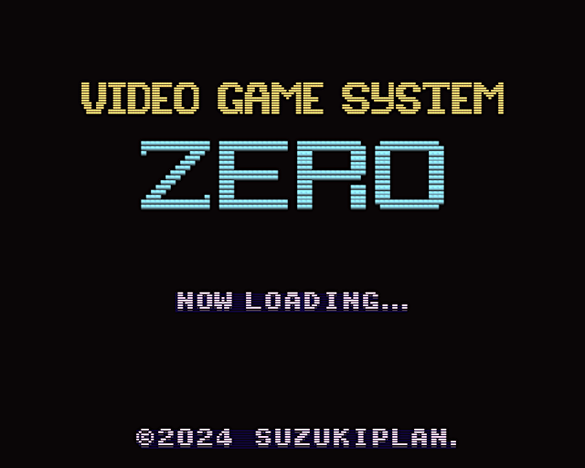

# [WIP] SUZUKI PLAN - Video Game System Zero



SUZUKI PLAN - Video Game System Zero (VGS0) は RaspberryPi Zero をコアに用いたゲーム機です。

本リポジトリは、VGS0 の本体コード、配布イメージ、SDK、パソコン（Linux または macOS）で動作するエミュレータを提供します。

## WIP status

- implementation
  - [x] CPU
  - [x] VDP
  - [x] BGM API
  - [x] Sound Effect API
  - [x] RaspberryPi Zero
  - [ ] RaspberryPi Zero 2W
  - [x] 22050Hz 1ch -> 44100Hz 2ch へ変更が必要かも（HDMIの仕様）
  - [ ] 44100Hz 2ch -> 44100Hz 1ch にする（モノラルでもイケたので）
  - [ ] game.rom, bgm.dat, se.dat を1ファイルに纏めたい (game.pkg)
- examples
  - [x] Hello, World!
  - [x] グローバル変数の使い方
  - [x] BGM再生
  - [x] SE再生
  - [ ] Map Scroll
  - [ ] スプライト
  - [ ] スプライト・BG・FG全表示しつつ音楽+効果音（限界性能チェック用）
  - [ ] アセンブリ言語実装例（Helloのみ）
- documents
  - [x] Z80: Memory map
  - [x] Z80: I/O map
  - [x] C API Library
  - [ ] `game.rom`
  - [ ] `bgm.dat`
  - [ ] `se.dat`
  - [ ] `game.pkg`

## VGS0 Feature

- CPU: Z80A 互換
  - Z80 アセンブリ言語でプログラムを記述
  - SDCC を用いて C 言語でもプログラミング可能
  - 最大 2MB (8kb × 256) のプログラムとデータ (※音声データを除く)
  - RAM サイズ 16KB (PV16相当!)
- VDP (映像処理)
  - 解像度: 240x192 ピクセル
  - 32,768 色中 256 色を同時発色可能
  - BG, FG, スプライトを合成描画
    - 最大 256 枚のキャラクタパターン (8x8ピクセル)
    - BG, FG のネームテーブルサイズ: 32x32 (256x256 ピクセル)
    - BG, FG: ハードウェアスクロール対応
    - 最大 256 枚のスプライトを表示可能（水平上限なし）
  - VRAM サイズ 16KB (TMS9918A 相当!)
- BGM
  - VGS の MML で記述された BGM を再生可能
  - ゲームプログラム (Z80) 側でのサウンドドライバ実装が不要!
  - ゲームプログラム (Z80) 側の RAM (16KB) を専有不要!
  - 本体 ROM (`game.rom`) とは別アセット（`bgm.dat`）
  - 最大 256 曲 & 合計 8MB 以下を搭載可能
- SE (効果音)
  - 22050Hz 16bit 1ch 形式の PCM 音源で効果音を再生
  - ゲームプログラム (Z80) 側でのサウンドドライバ実装が不要!
  - ゲームプログラム (Z80) 側の RAM (16KB) を専有不要
  - 本体 ROM (`game.rom`) とは別アセット（`se.dat`）
  - 最大 256 個 & 合計 8MB 以下を搭載可能

## How to Execute

### RaspberryPi Zero

1. FAT32 フォーマットされた SD カードを準備
2. SD カードのルートディレクトリに [./image/rpizero](./image/rpizero) または [./image/rpizero2](./image/rpizero2) 以下のファイルをコピー
3. `game.rom` を起動対象のゲームの ROM データに置き換える
4. `bgm.dat` を起動対象のゲームの BGM データに置き換える
5. `se.dat` を起動対象のゲームの効果音データに置き換える
6. SD カードを RaspberryPi Zero に挿入
7. RaspberryPi Zero に USB ゲームパッドを接続
8. RaspberryPi Zero とテレビを HDMI ケーブルで接続
9. RaspberryPi Zero に USB で電源を供給

### PC (Linux or macOS)

SDL2 版エミュレータ（[./src/sdl2](./src/sdl2)）をビルドして、コマンドラインオプションに起動対象の `game.rom`, `bgm.dat`, `se.dat` を指定して実行してください。

## Examples

| Directory | Language | Description |
| :-------- | :------- | :---------- |
| [example/01_hello](./example/01_hello/) | C言語 | `HELLO,WORLD!` を表示 |
| [example/02_global](./example/02_global/) | C言語 | グローバル変数の使用例 |
| [example/03_sound](./example/03_sound/) | C言語 | BGM と効果音の使用例 |

## Programming Guide

### Programming Language

- VGS0 のゲームは Z80 アセンブリ言語 または C言語 で記述することができます
  - Z80 アセンブリ言語: [./example/01_hello-asm](./example/01_hello-asm)
  - C言語: [./example/01_hello](./example/01_hello)
- C言語で記述する場合:
  - クロスコンパイラに SDCC (Small Device C) が使用できます
  - 標準ライブラリは使用できません
  - [vgs0.lib](./lib/sdcc/) を使用することができます

### API Manual for Programming Language C

[vgs0lib.h](./lib/sdcc/vgs0lib.h) の実装を参照してください。

実装を見た方が手っ取り早いと思われるので非推奨ですが、以下のコマンドを実行すれば HTML 形式のマニュアルを閲覧できます。

```
sudo apt install doxygen build-essential
git clone https://github.com/suzukiplan/vgszero
cd vgszero/lib/sdcc
make doc
open doc/html/index.html
```

### Create Sound Data

- VGS 形式の Music Macro Language (MML) で音楽データを記述できます
- 効果音には 44100Hz 16bits 2ch の wav ファイルを用いることができます

### How to Debug

デバッグには、パソコン（Linux または macOS）上で動作するエミュレータ（[./src/sdl2](./src/sdl2)）を用いると便利です。

### CPU Memory Map

メインプログラム（Z80）から見えるメモリマップは次の通りです。

| CPU address | Map |
| :---------: | :-- |
| 0x0000 ~ 0x1FFF | ROM Bank 0 |
| 0x2000 ~ 0x3FFF | ROM Bank 1 |
| 0x4000 ~ 0x5FFF | ROM Bank 2 |
| 0x6000 ~ 0x7FFF | ROM Bank 3 |
| 0x8000 ~ 0xBFFF | VRAM |
| 0xC000 ~ 0xFFFF | RAM (16KB) |

- プログラムの ROM データは 8KB 区切りになっていて最大 256 個のバンクを持つことができます
- 電源投入またはリセットすると ROM Bank には 0〜3 がセットされ、ポート B0〜B3 の I/O で [バンク切り替え](#bank-switch) ができます
- スタック領域は 0xFFFE から 0xC000 の方向に向かって使われます
- グローバル変数を使用する場合 0xC000 から順番に使い、スタックによる破壊がされないように気をつけてプログラミングしてください

### VRAM Memory Map

|   CPU address   |  VRAM address   | Map |
| :-------------: | :-------------: | :-- |
| 0x8000 ~ 0x83FF | 0x0000 ~ 0x03FF | BG [Name Table](#name-table) (32 x 32) |
| 0x8400 ~ 0x87FF | 0x0400 ~ 0x07FF | BG [Attribute](#attribute) Table (32 x 32) |
| 0x8800 ~ 0x8BFF | 0x0800 ~ 0x0BFF | FG [Name Table](#name-table) (32 x 32) |
| 0x8C00 ~ 0x8FFF | 0x0C00 ~ 0x0FFF | FG [Attribute](#attribute) Table (32 x 32) |
| 0x9000 ~ 0x93FF | 0x1000 ~ 0x13FF | [OAM](#oam); Object Attribute Memory (4 x 256) |
| 0x9400 ~ 0x95FF | 0x1400 ~ 0x15FF | [Palette](#palette) Table (2 x 16 x 16) |
| 0x9600          | 0x1600	        | Register #0: Scanline vertical counter (read only) |
| 0x9601          | 0x1601          | Register #1: Scanline horizontal counter (read only) |
| 0x9602          | 0x1602          | Register #2: BG Scroll X |
| 0x9603          | 0x1603          | Register #3: BG Scroll Y |
| 0x9604          | 0x1604          | Register #4: FG Scroll X |
| 0x9605          | 0x1605          | Register #5: FG Scroll Y |
| 0x9606          | 0x1606          | Register #6: IRQ scanline position (NOTE: 0 is disable) |
| 0x9607          | 0x1607          | Register #7: Status (read only) |
| 0xA000 ~ $BFFF  | 0x2000 ~ 0x3FFF | [Character Pattern Table](#character-pattern-table) (32 x 256) |

- VRAM へのアクセスは一般的な VDP とは異なり CPU アドレスへのロード・ストア（LD命令等）で簡単に実行できます
- BG と FG は 32x32 (256x256 ピクセル) のネームテーブルに書き込まれたキャラクタパターンが表示されます
- BG はスプライトの背面に表示され、FG はスプライトの前面に表示されます
- BG/FG は 0x9602 〜 0x9605 のレジスタに値を書き込むことでハードウェアスクロールができます
- IRQ によりスキャンライン位置を検知できますが 0x9600 のレジスタ参照でもスキャンライン位置を特定できるため、ラスター処理の実行に必ずしも割り込みが必要ではありません（基本的に割り込み無しでのプログラミングを想定しています）
- BG/FG/スプライトで使用するキャラクタパターンは共通です

#### (Name Table)

- VGS0 では 8x8 ピクセルの矩形単位の[キャラクタパターン](#character-pattern-table)番号をネームテーブルに書き込むことでグラフィックスを表示します
- ネームテーブルは 32 行 32 列の二次元配列です（BG/FG 共通）

#### (Attribute)

アトリビュートは、BG, FG, スプライト共通のキャラクタパターン表示属性です。

| Bit-7 | Bit-6 | Bit-5 | Bit-4 | Bit-3 | Bit-2 | Bit-1 | Bit-0 |
| :---: | :---: | :---: | :---: | :---: | :---: | :---: | :---: |
| `VI`  | `UD`  | `LR`  |   -   | `P3`  | `P2`  | `P1`  | `P0`  |

- `VI`: `0` = 非表示, `1` = 表示 _（※ BG に限り 0 でも表示されます）_
- `UD`: `1` にすると上下反転で表示
- `LR`: `1` にすると左右反転で表示
- `P0~P3`: [パレット](#palette)番号 (0 ~ 15)

#### (Palette)

- VGS0 では最大 16 個のパレットを使用できます
- 各パレットには 16 色を RGB555 形式で指定できます
- FG と スプライトの場合、色番号 0 は透明色になります

#### (OAM)

OAM はスプライトの表示座標、[キャラクタパターン](#character-pattern-table)番号、[属性](#attribute) の要素を持つ構造体です。

```c
struct OAM {
    unsigned char y;
    unsigned char x;
    unsigned char pattern;
    unsigned char attribute;
} oam[256];
```

VGS0 では最大 256 枚のスプライトを同時に表示でき、水平方向の表示数に上限がありません。

#### (Character Pattern Table)

- キャラクタパターンテーブルには 8x8 ピクセルのキャラクタパターンを最大 256 個定義できます
- 1 キャラクタのサイズは 32 bytes です
- テーブル全体のサイズは 32 x 256 = 8192 bytes で丁度バンクのサイズと一致します
- 特定のバンクの内容をキャラクタパターンテーブルに転送できる高速 DMA 機能が搭載されています

キャラクタパターンテーブルのビットレイアウトは次の通りです。

| px0 | px1 | px2 | px3 | px4 | px5 | px6 | px7 | Line number |
| :-: | :-: | :-: | :-: | :-: | :-: | :-: | :-: | :---------- |
| H00 | L00 | H01 | L01 | H02 | L02 | H03 | L03 | Line 0      |
| H04 | L04 | H05 | L05 | H06 | L06 | H07 | L07 | Line 1      |
| H08 | L08 | H09 | L09 | H10 | L10 | H11 | L11 | Line 2      |
| H12 | L12 | H13 | L13 | H14 | L14 | H15 | L15 | Line 3      |
| H16 | L16 | H17 | L17 | H18 | L18 | H19 | L19 | Line 4      |
| H20 | L20 | H21 | L21 | H22 | L22 | H23 | L23 | Line 5      |
| H24 | L24 | H25 | L25 | H26 | L26 | H27 | L27 | Line 6      |
| H28 | L28 | H29 | L29 | H30 | L30 | H31 | L31 | Line 7      |

- `Hxx` : 上位 4bit (0 ~ 15 = 色番号) ※xxはバイト位置
- `Lxx` : 下位 4bit (0 ~ 15 = 色番号) ※xxはバイト位置
- FGとスプライトの場合、色番号0は常に透明色です
- 使用するパレット番号は[属性](#attribute)に指定します

### I/O Map

|   Port    |  I  |  O  | Description  |
| :-------: | :-: | :-: | :----------- |
|   0xA0    |  o  |  -  | [ジョイパッド](#joypad) |
|   0xB0    |  o  |  o  | [ROM Bank](#bank-switch) 0 (default: 0x00) |
|   0xB1    |  o  |  o  | [ROM Bank](#bank-switch) 1 (default: 0x01) |
|   0xB2    |  o  |  o  | [ROM Bank](#bank-switch) 2 (default: 0x02) |
|   0xB3    |  o  |  o  | [ROM Bank](#bank-switch) 3 (default: 0x03) |
|   0xC0    |  -  |  o  | [ROM to Character DMA](#rom-to-character-dma) |
|   0xC2    |  -  |  o  | [memset 相当の DMA](#memset-dma) |
|   0xC3    |  -  |  o  | [memcpy 相当の DMA](#memcpy-dma) |
|   0xE0    |  -  |  o  | BGM を[再生](#play-bgm) |
|   0xE1    |  -  |  o  | BGM を[中断](#pause-bgm)、[再開](#resume-bgm)、[フェードアウト](#fadeout-bgm) |
|   0xF0    |  -  |  o  | 効果音を再生 |
|   0xF1    |  -  |  o  | 効果音を停止 |
|   0xF2    |  -  |  o  | 効果音が再生中かチェック |

### (JoyPad)

```z80
IN A, (0xA0)
```

| Bit-7 | Bit-6 | Bit-5 | Bit-4 | Bit-3 | Bit-2 | Bit-1 | Bit-0 |
| :---: | :---: | :---: | :---: | :---: | :---: | :---: | :---: |
| `Up`  | `Down` | `Left` | `Right` | `Start` | `Select` | `A` | `B` |

### (Bank Switch)

```z80
# Read current bank of ROM Bank 0
IN A, (0xB0)

# Switch ROM Bank 1 to No.17
LD A, 0x11
OUT (0xB1), A
```

### (ROM to Character DMA)

```z80
 # バンク番号 = 0x22 をキャラクタパターンへ転送
LD A, 0x22
OUT (0xC0), A
```

### (memset DMA)

```z80
LD BC, 0xC000   # 転送先アドレス
LD HL, 0x2000   # 転送バイト数
LD A,  0xFF     # 転送する値
OUT (0xC2), A   # memset
```

### (memcpy DMA)

```
LD BC, 0xC000   # 転送先アドレス (RAM)
LD DE, 0x6000   # 転送元アドレス (ROM Bank 3)
LD HL, 0x2000   # 転送バイト数 (8KB)
OUT (0xC3), A   # memcpy (※書き込んだ値は無視されるので何でもOK)
```

### (Play BGM)

```z80
LD A, 0x01      # 演奏対象のBGM番号を指定
OUT (0xE0), A   # BGMの演奏を開始
```

### (Pause BGM)

```z80
LD A, 0x00      # オペレーションID: Pause
OUT (0xE1), A   # BGMの演奏を中断
```

### (Resume BGM)

```z80
LD A, 0x01      # オペレーションID: Resume
OUT (0xE1), A   # BGMの演奏を再開
```

### (Fadeout BGM)

```z80
LD A, 0x02      # オペレーションID: Fadeout
OUT (0xE1), A   # BGMの演奏をフェードアウト
```

### (Play Sound Effect)

```z80
LD A, 0x01      # 再生する効果音の番号を指定
OUT (0xF0), A   # 効果音を再生
```

### (Stop Sound Effect)

```z80
LD A, 0x02      # 停止する効果音の番号を指定
OUT (0xF1), A   # 効果音を停止
```

### (Check Sound Effect)

```z80
LD A, 0x03      # チェックする効果音の番号を指定
OUT (0xF1), A   # 効果音をチェック (A=0: Stopped, A=1: Playing)
AND 0x01
JNZ EFF03_IS_PILAYING
JZ  EFF03_IS_NOT_PLAYING
```

## License

- VGS0 本体は GPLv3 の OSS です: [LICENSE-VGS0.txt](./LICENSE_VGS0.txt)
- VGS0 本体配布イメージには RaspberryPi ブートローダーが含まれます: [LICENCE.broadcom](./LICENCE.broadcom)
- VGS0 本体には Circle（GPLv3）が含まれます: [LICENSE-CIRCLE.txt](./LICENSE-CIRCLE.txt)
- VGS0 本体には LZ4 Library（2か条BSD）が含まれます: [LICENSE-LZ4LIB.txt](./LICENSE-LZ4LIB.txt)
- VGS0 本体には SUZUKI PLAN - Z80 Emulator (MIT) が含まれます: [LICENSE-Z80.txt](./LICENSE-Z80.txt)
- VGS0 Library for Z80 は MIT ライセンスの OSS です:[LICENSE-VGS0LIB.txt](./LICENSE_VGS0LIB.txt)
