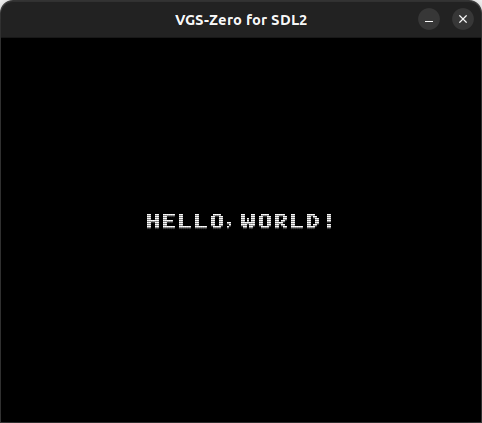
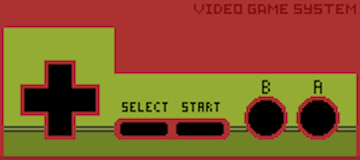
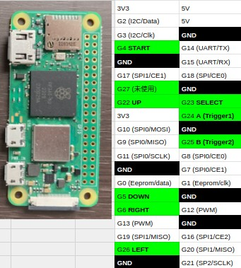
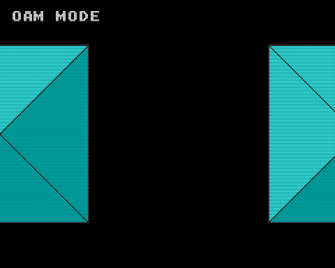
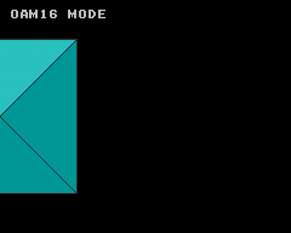
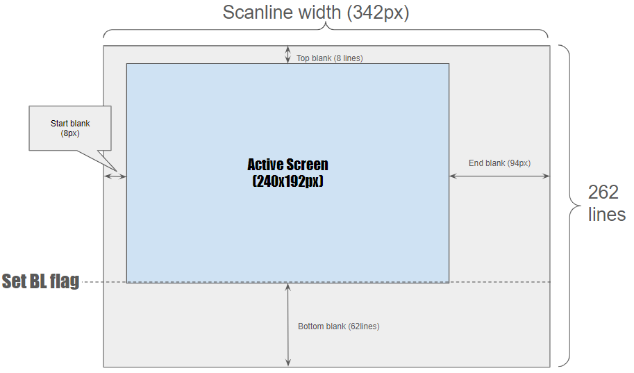

# Video Game System - Zero [](https://app.circleci.com/pipelines/github/suzukiplan/vgszero)

Language: __Japanese__, [English](./README-en.md)


Video Game System - Zero (VGS-Zero) は RaspberryPi Zero 2W のベアメタル環境で動作するゲーム機です。

本リポジトリは、VGS-Zero の本体コード、配布イメージ、SDK、パソコン（Linux または macOS）で動作するエミュレータを提供します。

## Table of Content

1. [VGS-Zero Feature](#vgs-zero-feature) ... スペック概要
1. [First Step Guide](#first-step-guide) ... 導入ガイド（PC）
1. [How to Execute](#how-to-execute) ... RaspberryPi Zero 2W での実行方法
1. [config.sys](#configsys) ... 動作設定ファイル
1. [game.pkg](#gamepkg) ... ゲーム実行形式ファイル
1. [Game Development Tools](#game-development-tools) ... 開発ツール（SDK）一覧
1. [Programming Guide](#programming-guide) ... プログラム開発ガイド
1. [How to Sell Your Game](#how-to-sell-your-game) ... セールス・ガイド
1. [Examples](#examples) ... サンプル・プログラム一覧
1. [License](#license) ... ライセンス情報

## VGS-Zero Feature

- CPU: Z80 16MHz (16,777,216Hz)
  - Z80 アセンブリ言語でプログラミング可能（[Programming Guide](#programming-guide)を参照）
  - C言語 (SDCC) でもプログラミング可能（[Programming Guide](#programming-guide)を参照）
  - ゲーム実行形式ファイル（[game.pkg](#gamepkg)）は最大 128 メガビット（100メガショック!）
  - [最大 2MB (8kb × 256banks)](#cpu-memory-map) のプログラムとデータ (※音声データを除く)
  - [RAM サイズ 16KB](#cpu-memory-map) (PV16相当!)
  - [拡張 RAM サイズ 2MB](#extra-ram-bank)
  - [セーブ機能](#save-data)に対応
- VDP; VGS-Video (映像処理)
  - [VRAM](#vram-memory-map) サイズ 16KB (TMS9918A 相当!)
  - 解像度: 240x192 ピクセル (TMS9918A より少しだけ狭い!)
  - [16 個の 16 色パレット](#palette)に対応（32,768 色中 256 色を同時発色可能）
  - 8x8 ピクセルの[キャラクタパターン](#character-pattern-table)を最大 256 枚 (8KB) 定義可能
  - [BG](#bg), [FG](#fg) の[ネームテーブル](#name-table)サイズ: 32x32 (256x256 ピクセル)
  - [ハードウェアスクロール](#hardware-scroll)対応（[BG](#bg), [FG](#fg) 各）
  - 最大 256 枚の[スプライト](#sprite)を表示可能（水平上限なし）
  - [BG](#bg), [FG](#fg), [スプライト](#sprite) にそれぞれ異なる[キャラクタパターン](#character-pattern-table)を設定できる [Direct Pattern Mapping](#direct-pattern-mapping) 機能に対応（最大 768 枚のキャラクターパターンを同時に表示可能）
  - [BG](#bg), [FG](#fg) は最大 [1024 パターンを表示できるモード](#1024-patterns-mode) に対応
  - [スプライト](#sprite)に複数の[キャラクタパターン](#character-pattern-table)を並べて表示できるハードウェア機能（[OAM Pattern Size](#oam-pattern-size)）を提供
  - [スプライト](#sprite)の [OAM](#oam) 毎に異なるバンクを指定できるハードウェア機能（[OAM Bank](#oam-bank)）を提供
  - [スプライト](#sprite)の座標系を 16bit にすることができる [OAM16](#oam16) を提供
- DMA (Direct Memory Access)
  - [特定の ROM バンクの内容をキャラクタパターンテーブルに高速転送が可能](#rom-to-character-dma)
  - [特定の ROM バンクの内容を任意メモリに任意サイズだけ転送が可能](#rom-to-memory-dma)
  - [C言語の `memset` に相当する高速 DMA 転送機能を実装](#memset-dma)
  - [C言語の `memcpy` に相当する高速 DMA 転送機能を実装](#memcpy-dma)
- HAGe (High-speed Accumulator for Game)
  - [ハードウェア当たり判定機能を実装](#collision-detection)
  - [ハードウェア乗算・除算・剰余算](#hardware-calculation)
  - [ハードウェア sin テーブル](#hardware-sin-table)
  - [ハードウェア cos テーブル](#hardware-cos-table)
  - [ハードウェア atan2 テーブル](#hardware-atan2-table)
  - [ハードウェア乱数](#hardware-random)
  - [ハードウェア・パーリンノイズ](#hardware-perlin-noise)
  - [角度計算](#angle-calculation)
  - [百分率計算](#percentage-calculation)
- [BGM](#bgmdat)
  - [VGS の MML](#compile-mml) または [NSF 形式](#nsf) の BGM を再生可能
  - ゲームプログラム (Z80) 側でのサウンドドライバ実装が不要!
  - ゲームプログラム (Z80) 側の RAM (16KB) を専有不要!
  - 本体 ROM ([`game.rom`](#gamerom)) とは別アセット（[`bgm.dat`](#bgmdat)）
  - 最大 256 曲
- [SE](#sedat) (効果音)
  - 44100Hz 16bit 1ch (モノラル) 形式の PCM データ (.wav ファイル) を効果音として再生可能
  - ゲームプログラム (Z80) 側でのサウンドドライバ実装が不要!
  - ゲームプログラム (Z80) 側の RAM (16KB) を専有不要
  - 本体 ROM ([`game.rom`](#gamerom)) とは別アセット（[`se.dat`](#sedat)）
  - 最大 256 個
- 入力機器:
  - [USB ジョイパッド](#joypad)
    - 8ボタン形式（カーソルキー、A/B、START/SELECT）のジョイパッドをサポート
    - [config.sys](#configsys) でボタン割当をカスタマイズ可能
  - [GPIO ジョイパッド](#gpio-joypad)
    - RaspberryPi の GPIO に直接接続するジョイパッドをサポート

## First Step Guide

VGS-Zero のゲーム開発環境の推奨 OS は [Ubuntu Desktop](https://jp.ubuntu.com/download) です。

より正確には、[2013 年モデルの MacBook Air へ Ubuntu Desktop をインストールした環境](https://qiita.com/suzukiplan/items/87fd32fe8e94b5a9bde5) が __不自由なく快適にゲームの開発に専念できる環境のベースライン__ です。

VGS-Zero ならゲームを開発するのに強い PC は必須ではありません。

以下、何もインストールされていない Ubuntu Desktop で VGS-Zero の [Hello, World! (Z80)](./example/01_hello-asm/) を動かすまでの手順を案内します。

```bash
# ツールチェインのビルドに必要なミドルウェアをインストール
sudo apt update
sudo apt install build-essential libsdl2-dev libasound2 libasound2-dev

# VGS-Zeroのリポジトリをダウンロード
git clone https://github.com/suzukiplan/vgszero

# example/01_hello-asm のディレクトリへ移動
cd vgszero/example/01_hello-asm

# ビルド & 実行
make
```

上記の手順を実行すれば VGS-Zero の SDL2 版エミュレータで `Hello, World!` が起動します。



VGS-Zero で扱えるグラフィックスの描画、効果音の作成、音楽の作曲などに必要なツールセットについては [Game Development Tools](#game-development-tools) の章で詳しくリストアップしています。

## How to Execute

実機（RaspberryPi Zero 2W）でゲームを動かすための手順を記します。

### Required Hardware

以下のハードウェアが必要です。

- RaspberryPi Zero 2W
- HDMI ケーブル (mini HDMI Type C → HDMI Type A)
- USB ジョイパッド（D-Pad+A/B+Start/Select）+ 変換アダプタ
- USB 電源
- micro SD カード
  - 最大 20MB 程度の空き容量が必要です（ゲーム本体: 最大16MB、ファームウェア: 約4MB）
- テレビなど（以下の条件のもの）
  - HDMI入力対応
  - リフレッシュレート60Hz
  - 解像度 480x384 ピクセル以上
  - オーディオ出力対応

#### (Joypad)

VGS-Zero は、カーソル（D-PAD）、Aボタン、Bボタン、SELECTボタン、STARTボタンの8ボタン式 USB ジョイパッドによる入力のみサポートしています。



RaspberryPi Zero 2W に接続する USB ジョイパッドのボタン割当（key config）は、[config.sys](#configsys) ファイルにより利用者が自由にカスタマイズできます。

PC（[SDL2](./src/sdl2/) 版）のキー割当は次の通りです:

- D-Pad: カーソルキー
- A ボタン: `X` キー
- B ボタン: `Z` キー
- START ボタン: `SPACE` キー
- SELECT ボタン: `ESC` キー

プログラムからは [0xA0 ポートの入力](#joypad-1) により入力状態を取得できます。

#### (Supported USB Joypad)

VGS-Zero での USB ジョイパッドのサポートリストを示します。

|製品名|サポート|補足事項|
|:-|:-:|:-|
|[HXBE37823 (XINYUANSHUNTONG)](https://ja.aliexpress.com/item/1005001905753033.html)|`OK`|完全に動作します|
|[suily USBコントローラー NESゲーム用（有線）](https://www.amazon.co.jp/dp/B07M7SYX11/)|`OK`|完全に動作します|
|[Elecom JC-U3312シリーズ](https://www.amazon.co.jp/dp/B003UIRHLE/)|`OK`|完全に動作します|
|[HORI リアルアーケードPro V3SA (PS3用)](https://www.amazon.co.jp/dp/B002YT9PSI)|`OK`|完全に動作します|
|[HORI グリップコントローラーアタッチメントセット for Nintendo Switch](https://www.amazon.co.jp/dp/B09JP9MFFY/)|`△`|十字キーが使用不可|
|[ロジクール (ロジテック) F310](https://www.amazon.co.jp/dp/B00CDG799E/)|`NG`|接続不可|
|[Kiwitata gamepad](https://github.com/rsta2/circle/wiki/Device-compatibility-list)|`NG`|Circleが非サポート|
|[Xbox 360 wired gamepad clone](https://github.com/rsta2/circle/wiki/Device-compatibility-list)|`NG`|Circleが非サポート|

> 標準 HID 準拠のジョイパッド（ゲームコントローラー）であれば動作できる可能性が高いです。
> パソコンでの利用に際して専用のデバイスドライバを必要とするものや、XInput対応のゲームコントローラー（比較的新しいゲームコントローラー）は、全く認識できなかったり、認識できても一部のキー入力が効かないものが多い傾向があるので非推奨です。
> SUZUKIPLAN が主に使用している製品は Elecom JC-U3312 と HXBE37823 です。Elecom JC-U3312 は EOL (製造終了) の商品のため入手が難しいかもしれません。HXBE37823 は [Aliexpress](https://ja.aliexpress.com/item/1005001905753033.html) に 300 円前後の安価なものが沢山あり、[Amazon](https://www.amazon.co.jp/dp/B07M7SYX11/) でも購入可能です。（ただし、HXBE37823 は上下左右の移動をする時に斜め入力が入ってしまうものがあり、感度の品質面に難があるかもしれませんが、[Battle Marine](https://github.com/suzukiplan/bmarine-zero/) のように左右に移動方向を絞ったゲームであれば快適にプレイできます）

#### (GPIO Joypad)

RaspberryPi Zero 2W の GPIO に次のピンアサインで直接ボタンを接続することもできます。

| Button | GPIO |
|:------:|:----:|
| Up     | 22   |
| Down   | 5    |
| Left   | 26   |
| Right  | 6    |
| A      | 24   |
| B      | 25   |
| Start  | 4    |
| Select | 23   |

RaspberryPi Zero 2W Pin Map



_※ GND の接続も必要です_

> GPIO 接続に関する詳細は [こちらの記事](https://note.com/suzukiplan/n/ncccafb305eae) をご参照ください。
>
> VGS-Zero 対応のジョイスティック・ジョイパッドは、企業（商業ハード）or 個人（同人ハード）に関係なく SUZUKIPLAN からのライセンス不要で自由に開発・販売していただくことが可能です。_（ライセンスは不要ですがサポートもしないスタイルなので、販売に伴う消費者へのサポート対応等は販売元の責任で行ってください）_

USB ジョイパッドよりも実装難度が高くなりますが次のメリットがあります。

- 互換性に関する問題が発生しない
- レスポンス速度が USB ジョイパッドよりも高速

VGS-Zero のゲームがプレイ可能なハードウェアを販売される場合、基本的には GPIO ジョイパッドで実装することを推奨します。

なお、USB と GPIO のジョイパッドの両方を接続している場合、USB ジョイパッドの入力が優先され、GPIO ジョイパッドの入力は行われません。

### Launch Sequence

起動手順は次の通りです。

1. FAT32 フォーマットされた SD カードを準備
2. SD カードのルートディレクトリに [./image](./image) 以下のファイルをコピー
3. [game.pkg](#gamepkg) を起動対象のゲームに置き換える
4. SD カードを RaspberryPi Zero 2W に挿入
5. RaspberryPi Zero 2W に USB ジョイパッドを接続
6. RaspberryPi Zero 2W とテレビを HDMI ケーブルで接続
7. RaspberryPi Zero 2W に電源を接続して ON

## config.sys

RaspberryPi Zero 2W に挿入する SD カードのルートディレクトリに `config.sys` ファイルを配置することで色々なカスタマイズができます。

### Joypad Button Assign

```
#--------------------
# JoyPad settings
#--------------------
A BUTTON_1
B BUTTON_0
SELECT BUTTON_8
START BUTTON_9
UP AXIS_1 < 64
DOWN AXIS_1 > 192
LEFT AXIS_0 < 64
RIGHT AXIS_0 > 192
```

（凡例）

```
# ボタン設定
key_name △ BUTTON_{0-31}

# AXIS設定
key_name △ AXIS_{0-1} △ {<|>} △ {0-255}
```

`key_name`:

- `A` Aボタン
- `B` Bボタン
- `START` STARTボタン
- `SELECT` SELECTボタン
- `UP` 上カーソル
- `DOWN` 下カーソル
- `LEFT` 左カーソル
- `RIGHT` 右カーソル

カーソルに `BUTTON_` を割り当てたり、ボタンに `AXIS_` を割り当てることもできます。

[tools/joypad](./tools/joypad/) を用いれば、お手持ちの USB ジョイパッドのボタン内容をチェックできます。

## game.pkg

game.pkg は VGS-Zero のゲーム実行形式ファイルで、ツールチェインの [makepkg コマンド](./tools/makepkg/) で生成することができます。

```
makepkg  -o /path/to/output.pkg
         -r /path/to/game.rom
        [-b /path/to/bgm.dat]
        [-s /path/to/se.dat]
```

- [game.rom](#gamerom): プログラムや画像データ
- [bgm.dat](#bgmdat): BGM データ
- [se.dat](#sedat): 効果音データ

なお、game.pkg の最大サイズは **16MB (128Mbits)** です。

### game.rom

game.rom は [ROMバンク](#cpu-memory-map)に読み込まれる 8KB 単位の ROM データセットで、ツールチェインの [makerom コマンド](./tools/makerom/) で生成することができます。

```
usage: makerom output input1 input2 ... input256
```

- 8KB (64KBit) = 1 バンク
- game.rom には最大 256 バンク (16MBit) を格納可能
- 入力ファイルが 8KB を超える場合、自動的に複数バンクに分割された状態で game.rom に格納されます
- 入力ファイルが 8KB で割り切れない場合、パディングデータが自動的に挿入されます
- 入力ファイルの指定順序でバンク番号が決定します（最初に指定したファイルの先頭 8KB がバンク 0）
- VGS-Zero が起動するとバンク 0 から 3 が　[CPU Memory Map](#cpu-memory-map) の ROM Bank 0 から 3 にロードされます
- バンク 0 は必ずプログラムコードでなければなりません

### bgm.dat

bgm.dat は 1 曲以上の楽曲データが含まれたデータセットで、ツールチェインの [makebgm コマンド](./tools/makebgm/) で生成することができます。

楽曲データは次の 2 種類のデータ形式をサポートしています

- [vgsmml コマンド](./tools/vgsmml) でコンパイルされた VGS; Video Game Sound 形式の BGM データ
- [NSF 形式](#nsf) の BGM データ

プログラム（Z80）で [再生を指示 (0xE0)](#play-bgm) した BGM データの種別は VGS-Zero 本体が自動的に識別します。

#### (Compile MML)

```
usage: vgsmml /path/to/file.mml /path/to/file.bgm
```

- MMLの仕様: [https://github.com/suzukiplan/vgs-mml-compiler/blob/master/MML-ja.md](https://github.com/suzukiplan/vgs-mml-compiler/blob/master/MML-ja.md)
- [東方BGM on VGS の MML](https://github.com/suzukiplan/tohovgs-cli/tree/master/mml) が全楽曲公開されているので、実用的な使い方はそちらが参考になるかもしれません
- MML ファイルは、ツールチェインの [vgsplay コマンド](./tools/vgsplay) を用いれば PC 上でプレビューできます

#### (NSF)

- NSF; NES Sound Format の BGM データは [FamiStudio](https://famistudio.org/) などの NSF 形式をサポートした DAW; Digital Audio Workstation を用いて作成することができます
- 詳しくは [example/15_nsf](example/15_nsf) を確認してください 
- 拡張音源については VRC6 のみサポートしています（VRC7, FME7, FDS, N106, MMC5 は非サポート）
- 参考記事: https://note.com/suzukiplan/n/n94ea503ff2c8
- NSF はデフォルトトラック（※NSF ヘッダの 8 バイト目で指定）のみを再生対象にしています
  - マルチトラック形式の NSF のデータを使用したい場合、デフォルトトラックを書き換えた複数の同じ NSF ファイルを bgm.dat へ組み込んでください

#### (Make bgm.dat)

```
makebgm bgm.dat song1.bgm [song2.bgm [song3.bgm...]]
```

BGM ファイルまたは NSF ファイルを最大 256 個指定することができます。

### se.dat

se.dat は、効果音のデータセットで、ツールチェインの [makese コマンド](./tools/makese/) で生成することができます。

```
makese se.dat se1.wav [se2.wav [se3.wav...]]
```

makese コマンドに指定できる .wav ファイルは、次の形式でなければなりません:

- 無圧縮 RIFF 形式
- サンプリングレート: 44100Hz
- ビットレート: 16bits
- チャネル数: 1 (モノラル)

.wav ファイルは最大 256 個指定することができます。

## Game Development Tools

VGS-Zero のゲーム開発に必要なツールの情報を記します。

### Recommended Game Development Tools

推奨開発ツールを紹介します。

| Name | Type | Information |
|:-----|:-----|:------------|
| [Ubuntu Desktop](https://jp.ubuntu.com/download)| OS | この表で示すツールは全て Ubuntu でも動作可能 |
| [Visual Studio Code](https://code.visualstudio.com/download) | コーディング | プログラムやMMLの記述<br>`vgsasm` 用の [拡張機能](https://github.com/suzukiplan/vgsasm) が利用可能 |
| [SDCC](https://sdcc.sourceforge.net/) | C コンパイラ | C 言語でゲームを開発する場合に利用を推奨<br>（だたし動作できるのはバージョン 4.1.0 のみ）|
| [aseprite](https://aseprite.org/) | 画像エディタ | 256 色 Bitmap 形式に対応した画像エディタ |
| [Tiled Map Editor](https://www.mapeditor.org) | マップエディタ | 利用例: [example/08_map-scroll](./example/08_map-scroll/) |
| [Jfxr](https://github.com/ttencate/jfxr) | 効果音エディタ | ブラウザ上でゲームの効果音を制作 |
| [FamiStudio](https://famistudio.org/) | BGM エディタ | [NSF 形式](#nsf) の BGM を制作できる DAW |

上記のツールがあれば、ゲームに必要なプログラムとアセット（グラフィックス、効果音、音楽）の全てを開発することができ、全てのツールは無料で使うことができます。（一部有料のものもありますが自分でソースコードをダウンロードしてビルドすれば無料で使うことができます）

> _必ずしも上記のツールでなければ開発できない訳ではありません。_

### Official Toolchain

本リポジトリで提供しているツール群は次の通りです。

| Name | Path | Type | Information |
|:-----|:-----|:-----|:------------|
| vgs0 | [./src/sdl2](./src/sdl2/) | Emulator | VGS-Zero PC エミュレータ & デバッガ (Linux, macOS) |
| vgsasm | [./tools/vgsasm](./tools/vgsasm) | CLI | Z80 アセンブラ |
| bmp2chr | [./tools/bmp2chr](./tools/bmp2chr/) | CLI | 256 色 Bitmap ファイルを [キャラクタパターン形式](#character-pattern-table) に変換 |
| csv2bin | [./tools/csv2bin](./tools/csv2bin/) | CLI | [Tiled Map Editor](https://www.mapeditor.org) の csv をバイナリ形式に変換 |
| makepkg | [./tools/makepkg](./tools/makepkg/) | CLI | [game.pkg](#gamepkg) を生成 |
| makerom | [./tools/makerom](./tools/makerom/) | CLI | [game.rom](#gamerom) を生成 |
| makese | [./tools/makese](./tools/makese/) | CLI | [se.dat](#sedat) を生成 |
| makebgm | [./tools/makebgm](./tools/makebgm/) | CLI | [bgm.dat](#bgmdat) を生成 |
| vgsmml | [./tools/vgsmml](./tools/vgsmml/) | CLI | [MML](#compile-mml) コンパイラ |
| vgsplay | [./tools/vgsplay](./tools/vgsplay/) | CLI | [MML](#compile-mml) を再生 |
| joypad | [./tools/joypad](./tools/joypad/) | RPi | USB ジョイパッドの入力テストツール |

## Programming Guide

### Programming Language

- VGS-Zero のゲームは Z80 アセンブリ言語 または C言語 で記述することができます
  - Z80: [./example/01_hello-asm](./example/01_hello-asm)
  - C言語: [./example/01_hello](./example/01_hello)
- アセンブリ言語で記述する場合:
  - 推奨アセンブラ: [vgsasm](./tools/vgsasm/)
  - _もちろん、その他の Z80 アセンブラも使用することができます_
- C言語で記述する場合:
  - クロスコンパイラに [SDCC (Small Device C Compiler)](https://sdcc.sourceforge.net/) を使用できます
  - 使用できる SDCC は **バージョン 4.1.0 のみ** です
  - 標準ライブラリは使用できません
  - [vgs0.lib](./lib/sdcc/) を使用することができます

**[vgsasm](./tools/vgsasm/) を用いた Z80 アセンブリ言語でのプログラミングを推奨します。**

Z80 アセンブリ言語でプログラミングする場合、VSCode (Visual Studio Code) の [Extension `vgsasm`](https://marketplace.visualstudio.com/items?itemName=suzukiplan.vgsasm) を用いることで快適なプログラミングができるようになります。

### Create Sound Data

- VGS 形式の Music Macro Language (MML) または NSF 形式（[FamiStudio](https://famistudio.org/)等）で [音楽データ](#bgmdat) を作成できます
- 44100Hz 16bits 1ch (モノラル) の wav ファイルで [効果音データ](#sedat) を作成できます

### Joypad Recommended Usage

VGS-Zero 向けに開発されるゲームは、ゲームの利用者が **可能な限りドキュメントなどを読まず** にゲームをプレイできるようにすることを目的として、敢えて [ジョイパッドのボタンをシンプルな 8 ボタン式（D-PAD, A/B, Select/Start）に固定](#joypad)しています。

- D-PAD usage
  - キャラクタやカーソルの移動などの目的で使用してください
- B button usage
  - 利用者が **頻繁に叩く（連打する）** ことが想定される操作に適したボタンです
  - 利用例: シューティングのショット、配管工によるファイアボールの発射、押したままカーソル入力でダッシュなど
  - RPG 等のコマンド操作のキャンセルは B ボタンを利用することが望ましいです
- A button usage
  - 利用者が **慎重に叩く** ことが想定される操作に適したボタンです
  - 利用例: シューティングのボンバー、ジャンプ、スナイピングショットなど
  - RPG 等のコマンド操作の決定は A ボタンを利用することが望ましいです
- START button usage
  - システム操作で押すことが想定されるボタンです
  - 利用例: ゲーム開始、ポーズ、コマンドを開くなど
- SELECT button usage
  - あまり利用することが想定されないボタンなので、積極的な利用は避けた方が良いと考えられます
  - 利用例: アーケード風ゲームのコイン投下など

### How to Debug

- デバッグには、パソコン（Linux または macOS）上で動作する SDL2 版エミュレータ（[./src/sdl2](./src/sdl2)）を用いると便利です
- SDL2 版エミュレータは NOP 命令を検出するとブレイクして、レジスタやメモリダンプを表示する[デバッグ機能](./src/sdl2#debug-mode)を備えています

### CPU Memory Map

メインプログラム（Z80）から見えるメモリマップは次の通りです。

| CPU address | Map |
| :---------: | :-- |
| 0x0000 ~ 0x1FFF | ROM Bank 0 |
| 0x2000 ~ 0x3FFF | ROM Bank 1 |
| 0x4000 ~ 0x5FFF | ROM Bank 2 |
| 0x6000 ~ 0x7FFF | ROM Bank 3 |
| 0x8000 ~ 0x9FFF | VRAM |
| 0xA000 ~ 0xBFFF | Extra RAM Bank |
| 0xC000 ~ 0xFFFF | Main RAM (16KB) |

- プログラムの ROM データは 8KB 区切りになっていて最大 256 個のバンクを持つことができます
- 電源投入またはリセットすると ROM Bank には 0〜3 がセットされ、ポート B0〜B3 の I/O で [バンク切り替え](#bank-switch) ができます
- スタック領域は 0xFFFE から 0xC000 の方向に向かって使われます
- グローバル変数を使用する場合 0xC000 から順番に使い、スタックによる破壊がされないように気をつけてプログラミングしてください

### RAM Scheme

VGS-Zero の RAM は大きく分類すると 3 種類の RAM 区画が存在します。

1. VRAM (0x8000 ~ 0x9FFF) = 8KB
2. Extra RAM Bank (0xA000 ~ 0xBFFF) = 8KB x 256 Banks (2MB)
3. Main RAM (0xC000 ~ 0xFFFF) = 16KB

VRAM は、[Name Table](#name-table)、[Attribute Table](#attribute)、[OAM](#oam)、[Palette](#palette)、VDP レジスタなどグラフィックスの表示や制御に関する機能で使用するメモリ区画です。

そして、Main RAM は変数（0xC000〜）やスタック（〜0xFFFF）などのデータ保持に用いるメモリ区画です。

Extra RAM Bank については VGS-Zero 特有の若干特殊なメモリ区画で、VRAM の [Character Pattern Table](#character-pattern-table)（TMS9918A と同じような用途）として使うこともできますが __その他の用途で利用__ することもできます。

VGS-Video では、[DPM; Direct Pattern Mapping](#direct-pattern-mapping) や [OAM Bank](#oam-bank) を用いることで ROM 上のデータをダイレクトにキャラクタパターンとして使用できるため、キャラクパターンを RAM (VRAM) へ展開する必要がありません。

キャラクタパターンを RAM（VRAM）へ展開する必要が無い場合、Extra RAM Bank はローグライク RPG のマップデータなどの広大なデータ領域などとして利用することができます。

### VRAM Memory Map

|   CPU address   |  VRAM address   | Map |
| :-------------: | :-------------: | :-- |
| 0x8000 ~ 0x83FF | 0x0000 ~ 0x03FF | [BG](#bg) [Name Table](#name-table) (32 x 32) |
| 0x8400 ~ 0x87FF | 0x0400 ~ 0x07FF | [BG](#bg) [Attribute](#attribute) Table (32 x 32) |
| 0x8800 ~ 0x8BFF | 0x0800 ~ 0x0BFF | [FG](#fg) [Name Table](#name-table) (32 x 32) |
| 0x8C00 ~ 0x8FFF | 0x0C00 ~ 0x0FFF | [FG](#fg) [Attribute](#attribute) Table (32 x 32) |
| 0x9000 ~ 0x97FF | 0x1000 ~ 0x17FF | [OAM](#oam); Object Attribute Memory (8 x 256) |
| 0x9800 ~ 0x99FF | 0x1800 ~ 0x19FF | [Palette](#palette) Table (2 x 16 x 16) |
| 0x9A00 ~ 0x9DFF | 0x1A00 ~ 0x1DFF | [OAM16](#oam16) |
| 0x9F00          | 0x1F00	        | Register #0: Vertical [Scanline Counter](#scanline-counter) (read only) |
| 0x9F01          | 0x1F01          | Register #1: Horizontal [Scanline Counter](#scanline-counter) (read only) |
| 0x9F02          | 0x1F02          | Register #2: [BG](#bg) [Scroll](#hardware-scroll) X |
| 0x9F03          | 0x1F03          | Register #3: [BG](#bg) [Scroll](#hardware-scroll) Y |
| 0x9F04          | 0x1F04          | Register #4: [FG](#fg) [Scroll](#hardware-scroll) X |
| 0x9F05          | 0x1F05          | Register #5: [FG](#fg) [Scroll](#hardware-scroll) Y |
| 0x9F06          | 0x1F06          | Register #6: IRQ scanline position (NOTE: 0 is disable) |
| 0x9F07          | 0x1F07          | Register #7: [Status](#vdp-status) (read only) |
| 0x9F08          | 0x1F08          | Register #8: [BG](#bg) の [Direct Pattern Maaping](#direct-pattern-mapping) |
| 0x9F09          | 0x1F09          | Register #9: [FG](#fg) の [Direct Pattern Maaping](#direct-pattern-mapping) |
| 0x9F0A          | 0x1F0A          | Register #10: [スプライト](#sprite) の [Direct Pattern Maaping](#direct-pattern-mapping) |
| 0x9F0B          | 0x1F0B          | Register #11: [BG/FG の 1024 パターンモード設定](#1024-patterns-mode) |
| 0x9F0C          | 0x1F0C          | Register #12: [BG/FG の インタレースモード設定](#interlace-mode) |
| 0xA000 ~ $BFFF  | 0x2000 ~ 0x3FFF | [Character Pattern Table](#character-pattern-table) (32 x 256) |

VRAM へのアクセスは一般的な VDP とは異なり CPU アドレスへのロード・ストア（LD命令等）で簡単に実行できます。

#### (BG)

- BG (Background Graphics) は、基本となる背景映像です
- [スプライト](#sprite) と [FG](#fg) の背面に表示されます
- ゲームの背景映像として利用することを想定しています
- [ネームテーブル](#name-table) に[キャラクタ番号](#character-pattern-table)と[属性](#attribute)を指定することで表示できます
- 透明色が存在しません
- [属性](#attribute)の指定で描画を非表示（hidden）にすることができません
- [FG](#fg) とは独立した [ハードウェアスクロール](#hardware-scroll) に対応しています

#### (FG)

- FG (Foreground Graphics) は、最前面に表示される映像です
- [BG](#bg) と [スプライト](#sprite) の前面に表示されます
- ゲームのスコアやメッセージウインドウなどの表示に利用することを想定しています
- [ネームテーブル](#name-table) に[キャラクタ番号](#character-pattern-table)と[属性](#attribute)を指定することで表示できます
- [パレット](#palette) の色番号 0 が透明色になります
- [属性](#attribute)の指定で描画を非表示（hidden）にすることができ、デフォルトは非表示になっています
- [BG](#bg) とは独立した [ハードウェアスクロール](#hardware-scroll) に対応しています

#### (Sprite)

- 妖精（Sprite）は、画面上を動き回るキャラクタ映像です
- [BG](#bg) の前面 & [FG](#fg) の背面 に表示されます
- ゲームのキャラクタ表示に利用することを想定しています
- 最大 256 枚を同時に表示できます
- [OAM](#oam) に表示座標、[キャラクタ番号](#character-pattern-table)、[属性](#attribute)、サイズを指定することで表示できます
- [属性](#attribute)の指定で描画を非表示（hidden）にすることができ、デフォルトは非表示になっています
- サイズはデフォルトは 1x1 パターン（8x8ピクセル）ですが最大で 16x16 パターン（128x128ピクセル）のものを1枚のスプライトとして表示できます（詳細は [OAM](#oam) の `widthMinus1` と `heightMinus1` の解説を参照）

#### (Name Table)

- VGS-Zero では 8x8 ピクセルの矩形単位の[キャラクタパターン](#character-pattern-table)番号をネームテーブルに書き込むことでグラフィックスを表示します
- ネームテーブルは 32 行 32 列の二次元配列です（BG/FG 共通）

#### (Attribute)

アトリビュートは、BG, FG, スプライト共通のキャラクタパターン表示属性です。

| Bit-7 | Bit-6 | Bit-5 | Bit-4 | Bit-3 | Bit-2 | Bit-1 | Bit-0 |
| :---: | :---: | :---: | :---: | :---: | :---: | :---: | :---: |
| `VI`  | `LR`  | `UD`  | `PTN` | `P3`  | `P2`  | `P1`  | `P0`  |

- `VI`: `0` = 非表示, `1` = 表示 _（※ BG に限り 0 でも表示されます）_
- `LR`: `1` にすると左右反転で表示
- `UD`: `1` にすると上下反転で表示
- `PTN`: `1` にすると [Direct Pattern Mapping](#direct-pattern-mapping) が有効な時のバンク番号を `+1`
- `P0~P3`: [パレット](#palette)番号 (0 ~ 15)

#### (Palette)

- VGS-Zero では最大 16 個のパレットを使用できます
- 各パレットには 16 色を RGB555 形式で指定できます
- FG と スプライトの場合、色番号 0 は透明色になります

#### (OAM)

OAM は次の要素を持つ構造体です。

1. スプライトの表示座標
2. [キャラクタパターン](#character-pattern-table)番号
3. [属性](#attribute)
4. [サイズ](#oam-pattern-size)
5. [OAM別バンク番号](#oam-bank)
6. [属性2](#attribute2)

```c
struct OAM {
    unsigned char y;
    unsigned char x;
    unsigned char pattern;
    unsigned char attribute;
    unsigned char heightMinus1;
    unsigned char widthMinus1;
    unsigned char bank;
    unsigned char attribute2;
} oam[256];
```

VGS-Zero では最大 256 枚のスプライトを同時に表示でき、水平方向の表示数に上限がありません。

#### (OAM Pattern Size)

[OAM](#oam) の `widthMinus1` と `heightMinus1` に 0 〜 15 の範囲で指定でき、1 以上の値を設定することで複数の[キャラクタパターン](#character-pattern-table)を並べて表示し、この時の[キャラクタパターン](#character-pattern-table)番号は、水平方向が +1、垂直方向は +16 (+0x10) づつ加算されます。

例えば `widthMinus1` が 2 で `heightMinus` が 3 の場合、下表の[キャラクタパターン](#character-pattern-table)グループを 1 枚のスプライトとして表示します。

|`\`|0|1|2|
|:-:|:-:|:-:|:-:|
|0|pattern+0x00|pattern+0x01|pattern+0x02|
|1|pattern+0x10|pattern+0x11|pattern+0x12|
|2|pattern+0x20|pattern+0x21|pattern+0x22|
|3|pattern+0x30|pattern+0x31|pattern+0x32|

#### (OAM Bank)

[OAM](#oam) の `bank` が 0 の場合、スプライトのキャラクタパターンには VRAM 上の[キャラクタパターン](#character-pattern-table)か、[Direct Pattern Mapping](#direct-pattern-mapping) で指定されたバンクのものが用いられますが、1 以上の値が指定されている場合、その指定値のバンク番号がその OAM のキャラクタパターンになります。

設定の優先度:

1. OAM Bank **(最優先)**
2. [Direct Pattern Mapping](#direct-pattern-mapping)
3. VRAM 上の[キャラクタパターン](#character-pattern-table) **(デフォルト)**

OAM Bank を用いることで、OAM 毎に異なるキャラクタパターンを使用できます。

#### (Attribute2)

アトリビュート2は、スプライト専用のキャラクタパターン表示属性です。

| Bit-7 | Bit-6 | Bit-5 | Bit-4 | Bit-3 | Bit-2 | Bit-1 | Bit-0 |
| :---: | :---: | :---: | :---: | :---: | :---: | :---: | :---: |
|   -   |   -   |   -   |   -   |   -   |   -   | `IH`  | `IV`  |

- `IH` : 奇数スキャンラインの描画をスキップ（横インタレース）
- `IV` : 奇数ピクセルの描画をスキップ（縦インタレース）

#### (OAM16)

OAM16 はスプライト座標を 16 bit の値にすることができる領域です。

```c
struct OAM16 {
    unsigned short y;
    unsigned short x;
} oam16[256];
```

OAM16 の x または y の値が非ゼロの場合に有効になります。

本機能を用いることで 24px 以上のサイズのスプライトがクリップ表示されるようになります。

| OAM | OAM16 |
|:-:|:-:|
|||

使用方法の詳細は [example/17_clip](./example/17_clip/) を確認してください。

#### (Scanline Counter)

- スキャンラインカウンタは、VDP のピクセルレンダリング位置を特定することができる読み取り専用の VDP レジスタです
- `0x9F00` が垂直方向で `0x9F01` が水平方向です
- 垂直方向の値を待機することでラスター[スクロール](#hardware-scroll)等の処理を **割り込み無し** で実装することができます
- 水平方向は高速に切り替わるため使い所は無いかもしれません

#### (Hardware Scroll)

- [BG](#bg) は `0x9F02` に X 座標, `0x9F03` に Y 座標の描画起点座標を指定することができます
- [FG](#fg) は `0x9F04` に X 座標, `0x9F05` に Y 座標の描画起点座標を指定することができます
- `0x9F02` ~ `0x9F05` を読み取ることで現在のスクロール位置を取得することもできます

#### (VDP Status)

| Bit-7 | Bit-6 | Bit-5 | Bit-4 | Bit-3 | Bit-2 | Bit-1 | Bit-0 |
| :---: | :---: | :---: | :---: | :---: | :---: | :---: | :---: |
|  BL   |   -   |   -   |   -   |   -   |   -   |   -   |   -   |

- BL: 1 = start vblank

BL フラグは可視領域の 192 ライン目（スキャンラインの 200 ライン目）の描画が終わったタイミングでセットされます。



NOTE: Status register always reset after read.

#### (Direct Pattern Mapping)

通常、[BG](#bg)、[FG](#fg)、[スプライト](#sprite)は共通の[キャラクターパターンテーブル](#character-pattern-table)を参照しますが、0x9F08、0x9F09、0x9F0A に **0以外** の値を書き込むことで、その値に対応する ROM バンクをそれぞれの[キャラクターパターンテーブル](#character-pattern-table)とすることができる DPM; Direct Pattern Mapping 機能を利用することができます。

- 0x9F08: [BG](#bg) の DPM
- 0x9F09: [FG](#fg) の DPM
- 0x9F0A: [スプライト](#sprite) の DPM

```z80
LD HL, 0x9F08
LD (HL), 0x10   # BG = Bank 16
INC HL
LD (HL), 0x11   # FG = Bank 17
INC HL
LD (HL), 0x12   # Sprite = Bank 18
```

> バンク切り替えアニメーションをしたい場合、[キャラクタパターンテーブル](#character-pattern-table) を [DMA](#rom-to-character-dma) で切り替えるよりも DPM を用いた方が CPU リソースを節約できます。


#### (1024 Patterns Mode)

0x9F0B の設定により BG/FG で利用できるパターン数を 1024 に拡張することができます。

> なお、本機能の利用には BG/FG の [DPM](#direct-pattern-mapping) の設定が必要です。

| Bit-7 | Bit-6 | Bit-5 | Bit-4 | Bit-3 | Bit-2 | Bit-1 | Bit-0 |
| :---: | :---: | :---: | :---: | :---: | :---: | :---: | :---: |
|   -   |   -   |   -   |   -   |   -   |   -   | `F1k` | `B1k` |

- `F1k` FG パターン数（0: 256, 1: 1024）
- `B1k` BG パターン数（0: 256, 1: 1024）

`B1k`, `F1k` をセットした場合、[ネームテーブル](#name-table) の `行÷8 + DPM` が適用されるパターンバンク番号になります。

- 0〜7行目: Pattern Bank = DPM + 0
- 8〜15行目: Pattern Bank = DPM + 1
- 16〜23行目: Pattern Bank = DPM + 2
- 24〜31行目: Pattern Bank = DPM + 3

[bmp2chr](./tools/bmp2chr/) に 256x256 ピクセルの `.bmp` ファイルを入力すれば、本モード用の 4 バンクセットの chr データを簡単に生成することができます。

> 詳細は [./example/14_1024ptn](./example/14_1024ptn/) を参照

#### (Interlace Mode)

0x9F0C の設定により BG/FG の描画をインタレース（奇数行または奇数ピクセルの描画をスキップ）することができます。

| Bit-7 | Bit-6 | Bit-5 | Bit-4 | Bit-3 | Bit-2 | Bit-1 | Bit-0 |
| :---: | :---: | :---: | :---: | :---: | :---: | :---: | :---: |
|   -   |   -   |   -   |   -   | `FH`  | `FV`  | `BH`  | `BV`  |

- `FH` : FG の奇数スキャンラインの描画をスキップ（横インタレース）
- `FV` : FG の奇数ピクセルの描画をスキップ（縦インタレース）
- `BH` : BG の奇数スキャンラインの描画をスキップ（横インタレース）
- `BV` : BG の奇数ピクセルの描画をスキップ（縦インタレース）

#### (Character Pattern Table)

- キャラクタパターンテーブルには 8x8 ピクセルのキャラクタパターンを最大 256 個定義できます
- 1 キャラクタのサイズは 32 bytes です
- テーブル全体のサイズは 32 x 256 = 8192 bytes で丁度バンクのサイズと一致します
- 特定のバンクの内容をキャラクタパターンテーブルに転送できる高速 DMA 機能が搭載されています

キャラクタパターンテーブルのビットレイアウトは次の通りです。

| px0 | px1 | px2 | px3 | px4 | px5 | px6 | px7 | Line number |
| :-: | :-: | :-: | :-: | :-: | :-: | :-: | :-: | :---------- |
| H00 | L00 | H01 | L01 | H02 | L02 | H03 | L03 | Line 0      |
| H04 | L04 | H05 | L05 | H06 | L06 | H07 | L07 | Line 1      |
| H08 | L08 | H09 | L09 | H10 | L10 | H11 | L11 | Line 2      |
| H12 | L12 | H13 | L13 | H14 | L14 | H15 | L15 | Line 3      |
| H16 | L16 | H17 | L17 | H18 | L18 | H19 | L19 | Line 4      |
| H20 | L20 | H21 | L21 | H22 | L22 | H23 | L23 | Line 5      |
| H24 | L24 | H25 | L25 | H26 | L26 | H27 | L27 | Line 6      |
| H28 | L28 | H29 | L29 | H30 | L30 | H31 | L31 | Line 7      |

- `Hxx` : 上位 4bit (0 ~ 15 = 色番号) ※xxはバイト位置
- `Lxx` : 下位 4bit (0 ~ 15 = 色番号) ※xxはバイト位置
- FGとスプライトの場合、色番号0は常に透明色です
- 使用するパレット番号は[属性](#attribute)に指定します

Character Pattern Table のメモリ領域（0xA000〜0xBFFF）は、[BG](#bg)、[FG](#fg)、[スプライト](#sprite) の全てを [Direct Pattern Mapping](#direct-pattern-mapping) にすることで 8KB の RAM 相当の領域とすることができます。更に、この領域は DMA による高速なバンクロードにも対応しているため、シューティングゲームや RPG などの広大なマップデータ（1 チップ 1 バイトなら最大で 64x128 チップ!!）の展開先領域として最適かもしれません。

### I/O Map

|   Port    |  I  |  O  | Description  |
| :-------: | :-: | :-: | :----------- |
|   0xA0    |  o  |  -  | [ジョイパッド](#joypad-1) |
|   0xB0    |  o  |  o  | [ROM Bank](#bank-switch) 0 (default: 0x00) |
|   0xB1    |  o  |  o  | [ROM Bank](#bank-switch) 1 (default: 0x01) |
|   0xB2    |  o  |  o  | [ROM Bank](#bank-switch) 2 (default: 0x02) |
|   0xB3    |  o  |  o  | [ROM Bank](#bank-switch) 3 (default: 0x03) |
|   0xB4    |  o  |  o  | [Extra RAM Bank](#extra-ram-bank) (default: 0x00) |
|   0xB5    |  -  |  o  | [Duplicate Extra RAM Bank](#duplicate-extra-ram-bank)|
|   0xC0    |  -  |  o  | [ROM to Character DMA](#rom-to-character-dma) |
|   0xC1    |  -  |  o  | [ROM to Memory DMA](#rom-to-memory-dma) |
|   0xC2    |  -  |  o  | [memset 相当の DMA](#memset-dma) |
|   0xC3    |  -  |  o  | [memcpy 相当の DMA](#memcpy-dma) |
|   0xC4    |  o  |  -  | [当たり判定](#collision-detection) |
|   0xC5    |  -  |  o  | [乗算・除算・剰余算](hardware-calculation) |
|   0xC6    |  -  |  o  | [ハードウェア sin テーブル](#hardware-sin-table) |
|   0xC7    |  -  |  o  | [ハードウェア cos テーブル](#hardware-cos-table) |
|   0xC8    |  o  |  -  | [ハードウェア atan2 テーブル](#hardware-atan2-table) |
|   0xC9    |  o  |  o  | [ハードウェア乱数 (8-bits)](#hardware-random) |
|   0xCA    |  o  |  o  | [ハードウェア乱数 (16-bits)](#hardware-random) |
|   0xCB    |  -  |  o  | [パーリンノイズのシード設定](#hardware-perlin-noise) |
|   0xCC    |  -  |  o  | [パーリンノイズのX座標縮尺を設定](#hardware-perlin-noise) |
|   0xCD    |  -  |  o  | [パーリンノイズのY座標縮尺を設定](#hardware-perlin-noise) |
|   0xCE    |  o  |  -  | [パーリンノイズを取得](#hardware-perlin-noise) |
|   0xCF    |  o  |  -  | [パーリンノイズを取得（オクターブあり）](#hardware-perlin-noise) |
|   0xD0    |  o  |  o  | [角度計算](#angle-calculation) |
|   0xD1    |  o  |  o  | [百分率計算](#percentage-calculation) |
|   0xDA    |  o  |  o  | [データのセーブ・ロード](#save-data) |
|   0xE0    |  -  |  o  | BGM を[再生](#play-bgm) |
|   0xE1    |  -  |  o  | BGM を[中断](#pause-bgm)、[再開](#resume-bgm)、[フェードアウト](#fadeout-bgm) |
|   0xF0    |  -  |  o  | 効果音を再生 |
|   0xF1    |  -  |  o  | 効果音を停止 |
|   0xF2    |  -  |  o  | 効果音が再生中かチェック |

#### (JoyPad)

```z80
IN A, (0xA0)
```

| Bit-7 | Bit-6 | Bit-5 | Bit-4 | Bit-3 | Bit-2 | Bit-1 | Bit-0 |
| :---: | :---: | :---: | :---: | :---: | :---: | :---: | :---: |
| `Up`  | `Down` | `Left` | `Right` | `Start` | `Select` | `A` | `B` |

- 0: 入力がある状態
- 1: 入力がない状態

#### (Bank Switch)

```z80
# Read current bank of ROM Bank 0
IN A, (0xB0)

# Switch ROM Bank 1 to No.17
LD A, 0x11
OUT (0xB1), A
```

#### (Extra RAM Bank)

ポート番号 0xB4 を OUT することで、Extra RAM Bank（0xA000〜0xBFFF = [Character Pattern Table](#character-pattern-table) の RAM 領域 (8KB) ）をバンク切り替えすることで、最大 2MB (8KB x 256) の RAM を使用することができます。

```z80
# Read Current Extra RAM Bank
IN A, (0xB4)

# Switch Extra RAM Bank to No.3
LD A, 0x03
OUT (0xB4), A
```

#### (Duplicate Extra RAM Bank)

ポート番号 0xB5 を OUT することで、現在の Extra RAM Bank の内容を別の Extra RAM Bank へ複製することができます。

```z80
; 現在の Extra RAM Bank = 0x00
XOR A
OUT (0xB4), A

; 0x00 の内容を 0x03 へ複製
LD A, 0x03
OUT (0xB5), A
```

#### (ROM to Character DMA)

ポート番号 0xC0 を OUT することで、特定のバンクの内容を [VRAM](#vram-memory-map) の[キャラクタパターンテーブル](#character-pattern-table)へ DMA 転送することができます。

```z80
 # バンク番号 = 0x22 をキャラクタパターンへ転送
LD A, 0x22
OUT (0xC0), A
```

#### (ROM to Memory DMA)

ポート番号 0xC1 を OUT することで、特定のバンクの特定サイズの内容を任意のアドレスに DMA 転送することができます。

この命令は BC, DE, HL に次の内容を設定します:

- BC: 転送元バンク内のオフセット（0x0000〜0x1FFF）
- DE: 転送サイズ（8192 - BC 以下）
- HL: 転送先アドレス

以下にバンク番号 0x23 の 0x1234 から 512 バイトを 0xCE00 (RAM) へ DMA 転送する例を示します。

```z80
LD A, 0x23
LD BC, 0x1234
LD DE, 512
LD HL, 0xCE00
OUT (0xC1), A
```

#### (memset DMA)

```z80
LD BC, 0xC000   # 転送先アドレス
LD HL, 0x2000   # 転送バイト数
LD A,  0xFF     # 転送する値
OUT (0xC2), A   # memset
```

#### (memcpy DMA)

```z80
LD BC, 0xC000   # 転送先アドレス (RAM)
LD DE, 0x6000   # 転送元アドレス (ROM Bank 3)
LD HL, 0x2000   # 転送バイト数 (8KB)
OUT (0xC3), A   # memcpy (※書き込んだ値は無視されるので何でもOK)
```

#### (Collision Detection)

以下の 8 bytes の構造体が格納されたアドレスを HL に指定して 0xC4 を IN することで当たり判定ができます。

```c
struct rect {
    uint8_t x;      // X座標
    uint8_t y;      // Y座標
    uint8_t width;  // 幅
    uint8_t height; // 高さ
} chr[2];           // それらを 2 キャラクタ分（8bytes）
```

```z80
LD HL, 0xC000   # 構造体の先頭アドレス
IN A, (0xC4)    # チェック実行
AND A           # ゼロチェック
JNZ DETECT_HIT  # 衝突を検出
JZ NOT_HIT      # 非衝突
```

#### (Hardware Calculation)

0xC5 の OUT により Z80 が苦手とする乗算、除算、剰余算を高速に実行できます。

```
# 8bit 演算命令
OUT (0xC5), 0x00 ... HL = H * L
OUT (0xC5), 0x01 ... HL = H / L
OUT (0xC5), 0x02 ... HL = H % L

# 8bit 演算命令 (符号付き)
OUT (0xC5), 0x40 ... HL = H * L
OUT (0xC5), 0x41 ... HL = H / L

# 16bit 演算命令
OUT (0xC5), 0x80 ... HL = HL * C (※HL: 演算結果 mod 65536)
OUT (0xC5), 0x81 ... HL = HL / C
OUT (0xC5), 0x82 ... HL = HL % C

# 16bit 演算命令 (符号付き)
OUT (0xC5), 0xC0 ... HL = HL * C (※HL: 演算結果 mod 65536)
OUT (0xC5), 0xC1 ... HL = HL / C

※ゼロ除算が実行された場合の HL は 0xFFFF
```

#### (Hardware SIN table)

```z80
LD A, 123      # A に求めるテーブル要素番号を指定
OUT (0xC6), A  # A = sin(A × π ÷ 128.0)
```

#### (Hardware COS table)

```z80
LD A, 123      # A に求めるテーブル要素番号を指定
OUT (0xC7), A  # A = cos(A × π ÷ 128.0)
```

#### (Hardware ATAN2 table)

```z80
LD H, <<<y1 - y2>>>   # H に Y 座標の差を設定
LD L, <<<x1 - x2>>>   # L に X 座標の差を設定
IN A, (0xC8)          # A に (x1, y1) と (x2, y2) の角度を求める
```

#### (Hardware Random)

収束保証型の乱数を取得することができます。

> 収束保証とは 8 ビットなら 256 回呼び出すと 0 から 255、16 ビットなら 65536 回呼び出すと 0 から 65535 の数が必ず 1 回づつ出現することを意味します。

```z80
# 8 bits 乱数の種を設定
LD L, 123
LD A, L
OUT (0xC9), A

# 8 bits 乱数を取得 (乱数は L レジスタにも格納される点を注意)
IN A, (0xC9)

# 16 bits 乱数の種を設定（OUT への指定値は無視されるので何でも OK）
LD HL, 12345
OUT (0xCA), A

# 16 bits 乱数を取得 (乱数は HL レジスタにも格納される点を注意)
IN A, (0xCA)
```

#### (Hardware Perlin Noise)

パーリンノイズを取得することができます。

> 詳細は [./example/13_perlin](./example/13_perlin/) を参照

```z80
# 乱数シードを設定
LD HL, 12345
OUT (0xCB), A

# X方向の縮尺を設定（小さいほど縮尺が大きい）
LD HL, 123
OUT (0xCC), A

# Y方向の縮尺を設定（小さいほど縮尺が大きい）
LD HL, 456
OUT (0xCD), A

# パーリンノイズを取得
LD HL, 789 # X座標
LD DE, 123 # Y座標
IN A, (0xCE)

# パーリンノイズをオクターブ指定して取得
LD HL, 789 # X座標
LD DE, 123 # Y座標
LD A, 10   # オクターブ
IN A, (0xCF)
```

#### (Angle Calculation)

以下の 8 bytes の構造体が格納されたアドレスを HL に指定して 0xD0 を IN することで角度と16bit固定小数点の移動速度を計算することができます。

```c
struct rect {
    uint8_t x;      // X座標
    uint8_t y;      // Y座標
    uint8_t width;  // 幅
    uint8_t height; // 高さ
} chr[2];           // それらを 2 キャラクタ分（8bytes）
```

```z80
LD HL, 0xC000
IN A, (0xD0)
```

- `A` = 角度 (0〜255)
- `BC` = X 方向の移動速度（B = 整数, C = 少数）
- `DE` = Y 方向の移動速度（B = 整数, C = 少数）

また、 角度を指定して 0xD0 を OUT することで、その角度に対応する `BC` と `DE` を求めることができます。

まずは、0xD0 の IN で自機狙いの計算をして、求まった角度 A を加算したり減算して OUT をすることで自機ずらしを簡単に実装することができます。

#### (Percentage Calculation)

0xD1 を OUT することで、HLに格納された数値を 0% から 255% 範囲で計算することができます。

```
LD HL, 300
LD A, 150
OUT (0xD1), A   # HL = 450 (300 の 150%)
```

> HL の数値は符号付き 16bit 整数（signed short）として計算されます。

また、0xD1 を IN することで BC が DE の何パーセントになのか 0% 〜 255% の範囲で求めることができます。

```z80
LD BC, 33
LD DE, 100
IN A, (0xD1)  ; A = 33%
```

- DE が 0 の場合、結果は常に 0% になり、ゼロ除算エラーにはなりません
- 結果が 255% を超える場合は 255% に丸められます

#### (Save Data)

- ポート 0xDA の I/O でセーブ（OUT）、ロード（IN）ができます
- セーブデータのファイル名は SD カードルートディレクトリ（SDL2の場合はカレントディレクトリ）の `save.dat` 固定です
- RPG のセーブ機能や STG のハイスコア保存機能などで利用することを想定しています

セーブの実装例:

```z80
LD BC, 0xC000   # セーブするデータのアドレスを指定 (RAM 領域のみ指定可能)
LD HL, 0x2000   # セーブするデータのサイズを指定 (最大 16 KB = 0x4000)
OUT (0xDA), A   # セーブ (※書き込んだ値は無視されるので何でもOK)
AND 0xFF        # セーブ結果はレジスタAに格納される
JZ SAVE_SUCCESS # 成功時は 0
JNZ SAVE_FAILED # 失敗時は not 0
```

ロードの実装例:

```z80
LD BC, 0xC000   # ロード先のアドレスを指定 (RAM 領域のみ指定可能)
LD HL, 0x2000   # ロードするデータサイズを指定 (最大 16 KB = 0x4000)
IN A, (0xDA)    # ロード (※書き込んだ値は無視されるので何でもOK)
JZ LOAD_SUCCESS # ロード成功時は 0
JNZ LOAD_FAILED # ロード失敗時は not 0 (※ロード先は 0x00 で埋められる)
```

RaspberryPi 固有の注意事項:

- SDカードへのセーブは非同期に行われるため、SDカードが挿入されていないなどの不正な状態でもセーブは成功を返します（この時、SDカードの書き込みに失敗した旨のシステムメッセージが画面上に表示されます）
- SDカードの劣化を防ぐ目的でセーブデータの内容に変更が加えられた時にのみ save.dat の書き込みを行います
- セーブ中は LED ランプが点灯し、書き込み失敗時は 3 回ブリンクします
- セーブ中に電源断を行うと SD カードが破損する恐れがあります
- カーネルは、セーブとロードが実行された時に SD カードのマウントを行い、処理が完了すると自動的にアンマウントします

共通の注意事項:

- save.dat がロード時に指定したサイズ（HL）よりも小さくてもロードは成功し、この時、データが存在しない領域は 0x00 で埋められます
- スタック領域へのロードを行うとプログラムが暴走する可能性があります
- ユーザが異なるゲームのセーブデータを用いて動かす可能性を考慮するのが望ましいです

#### (Play BGM)

```z80
LD A, 0x01      # 演奏対象のBGM番号を指定
OUT (0xE0), A   # BGMの演奏を開始
```

#### (Pause BGM)

```z80
LD A, 0x00      # オペレーションID: Pause
OUT (0xE1), A   # BGMの演奏を中断
```

#### (Resume BGM)

```z80
LD A, 0x01      # オペレーションID: Resume
OUT (0xE1), A   # BGMの演奏を再開
```

#### (Fadeout BGM)

```z80
LD A, 0x02      # オペレーションID: Fadeout
OUT (0xE1), A   # BGMの演奏をフェードアウト
```

#### (Play Sound Effect)

```z80
LD A, 0x01      # 再生する効果音の番号を指定
OUT (0xF0), A   # 効果音を再生
```

#### (Stop Sound Effect)

```z80
LD A, 0x02      # 停止する効果音の番号を指定
OUT (0xF1), A   # 効果音を停止
```

#### (Check Sound Effect)

```z80
LD A, 0x03      # チェックする効果音の番号を指定
OUT (0xF2), A   # 効果音をチェック (A=0: Stopped, A=1: Playing)
AND 0x01
JNZ EFF03_IS_PILAYING
JZ  EFF03_IS_NOT_PLAYING
```

## How to Sell Your Game

### RaspberryPi Zero 2W

コミックマーケットや通販で VGS-Zero 用のゲームを販売する時は、

1. FAT32 でフォーマットした micro SD カードを準備
2. [./image](./image/) 以下のファイルを micro SD カードのルートディレクトリへコピー
3. [game.pkg](#gamepkg) を差し替え
4. [README](./image/README) を削除
5. README.txt（ゲームの遊び方を記載したテキスト）を格納
6. micro-SD カードをケースなどに格納
7. ケースにゲームのラベルを塗布

といった形で媒体を準備して販売するのが良いかと思われます。（ダウンロード販売の場合は SD カードに格納するものと同等のものを ZIP で固めて販売）

README.txtの記載凡例:

```
================================================================================
<<<ゲームタイトル>>>
<<<コピーライト>>>
================================================================================

この度は「<<<ゲームタイトル>>>」をお買い上げいただき誠にありがとうございます。
本書は本ゲームの遊び方などを記載していますので、プレイ前にご一読ください。


【必要なハードウェア】
・RaspberryPi Zero 2W
・HDMI ケーブル (mini HDMI Type C → HDMI Type A)
・USB ジョイパッド（D-Pad+A/B+Start/Select）+ 変換アダプタ
・USB 電源
・テレビなど（以下の条件のもの）
  - HDMI入力対応
  - リフレッシュレート60Hz
  - 解像度 480x384 ピクセル以上
  - オーディオ出力対応


【起動方法】
・RaspberryPi Zero 2W に本製品（micro SDカード）を挿入
・RaspberryPi Zero 2W の電源を ON


【ボタン割り当ての変更方法】
ジョイパッドのボタン割当は config.sys でカスタマイズできます。
config.sys に設定すべき内容については、以下のツールでチェックできます。
https://github.com/suzukiplan/vgszero/tree/master/tools/joypad


【遊び方】
<<<ゲームの遊び方を記載>>>


【連絡先】
<<<Twitter（通称X）のアカウントなどを記載>>>
```

通販で販売する場合、ロット数が多い場合は同人ショップでの委託販売が良いかもしれませんが、小ロット（100本以下程度）であればメルカリあたりが手軽で良いかもしれません。

販売により得られた収益の SUZUKIPLAN へのペイバック（ライセンス料）等は一切不要です。

### Steam

- [VGS-Zero SDK for Steam](https://github.com/suzukiplan/vgszero-steam) を使えば Steam (Windows & SteamDeck) 版を簡単に作成できます
- VGS-Zero SDK for Steam の利用には Steamworks への加入と App クレジットの購入が必要です
- 販売により得られた収益の SUZUKIPLAN へのペイバック（ライセンス料）等は一切不要です

### Nintendo Switch

将来的に対応したいと思っています（[参考](https://qiita.com/suzukiplan/items/8a740b593816ef9ef565#%E4%BB%BB%E5%A4%A9%E5%A0%82switch%E5%AF%BE%E5%BF%9C%E4%BA%88%E5%AE%9A)）

## Examples

| Name | Language   | Description |
| :--- | :--------: | :---------- |
| `01_hello` | [Z80](./example/01_hello-asm/), [C](./example/01_hello/) | `HELLO,WORLD!` を表示 |
| `02_global` | [Z80](./example/02_global-asm/), [C](./example/02_global/) | グローバル変数の使用例 |
| `03_sound` | [Z80](./example/03_sound-asm/), [C](./example/03_sound/) | BGM と効果音の使用例 |
| `04_heavy` | [C](./example/04_heavy/) | エミュレータ側の負荷を最大化する検査用プログラム |
| `05_sprite256` | [Z80](./example/05_sprite256-asm/), [C](./example/05_sprite256/) | スプライトを256表示して動かす例 |
| `06_save` | [Z80](./example/06_save-asm/), [C](./example/06_save/) | [セーブ機能](#save-data)の例 |
| `07_palette` | [Z80](./example/07_palette-asm/), [C](./example/07_palette/) | 16個の[パレット](#palette)を全て使った例 |
| `08_map-scroll` | [Z80](./example/08_map-scroll-asm/), [C](./example/08_map-scroll/) | Tiled Map Editor で作ったマップデータのスクロール |
| `09_joypad` | [Z80](./example/09_joypad-asm/), [C](./example/09_joypad/) | ジョイパッドの入力結果をプレビュー |
| `10_chr720` | [Z80](./example/10_chr720-asm/), [C](./example/10_chr720/) | [Direct Pattern Mapping](#direct-pattern-mapping) で 1 枚絵を表示する例 |
| `11_bigsprite` | [Z80](./example/11_bigsprite-asm/), [C](./example/11_bigsprite/) | [OAM](#oam) の `widthMinus1`, `heightMinus1`, `bank` の使用例 |
| `12_angle` | [Z80](./example/12_angle-asm), [C](./example/12_angle) | [atan2](#hardware-atan2-table) を用いた自機狙いの実装例 |
| `13_perlin` | [Z80](./example/13_perlin-asm), [C](./example/13_perlin) | [ハードウェア・パーリンノイズ](#hardware-perlin-noise) の利用例 |
| `14_1024ptn` | [Z80](./example/14_1024ptn-asm), [C](./example/14_1024ptn) | [1024 パターンモード](#1024-patterns-mode) の利用例 |
| `15_nsf` | [Z80](./example/15_nsf-asm/), [C](./example/15_nsf/) | [NSF](#nsf) の利用例 |
| `16_ptn-plus1` | [Z80](./example/16_ptn-plus1-asm/), [C](./example/16_ptn-plus1/) | [Attribute](#attribute) の `ptn` の使用例 |
| `17_clip` | [Z80](./example/17_clip-asm/), [C](./example/17_clip/) | [OAM16](#oam16) の使用例 |

## License

- VGS-Zero 本体は GPLv3 の OSS です: [LICENSE-VGS0.txt](./LICENSE_VGS0.txt)
- VGS-Zero 本体配布イメージには RaspberryPi ブートローダーが含まれます: [LICENCE.broadcom](./LICENCE.broadcom)
- VGS-Zero 本体には Circle（GPLv3）が含まれます: [LICENSE-CIRCLE.txt](./LICENSE-CIRCLE.txt)
- VGS-Zero 本体には SUZUKI PLAN - Z80 Emulator (MIT) が含まれます: [LICENSE-Z80.txt](./LICENSE-Z80.txt)
- VGS-Zero 本体には NEZplug (Free Software) が含まれます: [LICENSE-NEZplug.txt](./LICENSE-NEZplug.txt)
- VGS-Zero 本体には NSFPlay (GPLv3) を改変したプログラムが含まれます: [LICENSE-NSFPlay-alter.txt](./LICENSE-NSFPlay-alter.txt)
- VGS-Zero 本体には KM6502 (Free Software) が含まれます: [LICENSE-km6502.txt](./LICENSE-km6502.txt)
- VGS-Zero Library for Z80 は MIT ライセンスの OSS です: [LICENSE-VGS0LIB.txt](./LICENSE_VGS0LIB.txt)

> あなたが開発した[game.pkg](#gamepkg)の著作権はあなたに帰属し、商業利用を含む自由な利用が可能です。
>
> VGS-Zero Library for Z80 のみ[game.pkg](#gamepkg)内に組み込まれる場合がありますが、その他の OSS はすべてカーネル（VGS-Zero本体）側で利用しているものなので、開発したゲームのライセンスに影響しません。
>
> ただし、再配布時に同梱する場合は [./image/README](./image/README) に記載されている事項を遵守する必要がありますので、内容を注意深くご確認ください。
