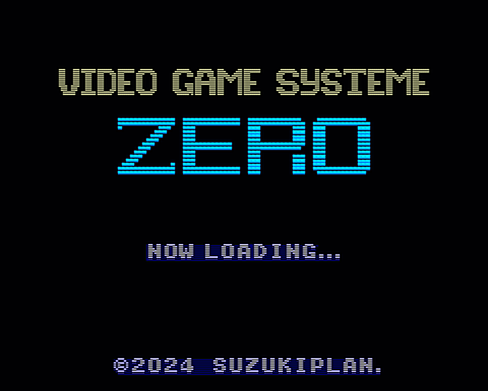

# SUZUKI PLAN - Video Game System Zero

SUZUKI PLAN - Video Game System Zero (VGS0) は、FCS80 と VGS の機能を融合した新しいレトロゲーム機です。

VGS0 向け開発したゲームは RaspberryPi Zero (ベアメタル環境) で動作させることができますが、Linux または macOS 上で動作をデバッグすることもできます。

## VGS0 Feature

- CPU: Z80A 互換
  - Z80 アセンブリ言語でプログラムを記述
  - SDCC を用いて C 言語でもプログラミング可能
  - 最大 2MB (8kb × 256) のプログラムとデータ (※音声データを除く)
  - RAM サイズ 16KB (PV16相当!)
- VDP (映像処理)
  - 解像度: 240x192 ピクセル
  - 32,768 色中 256 色を同時発色可能
  - BG, FG, スプライトを合成描画
    - 最大 256 枚のキャラクタパターン (8x8ピクセル)
    - BG, FG のネームテーブルサイズ: 32x32 (256x256 ピクセル)
    - BG, FG: ハードウェアスクロール対応
    - 最大 256 枚のスプライトを表示可能（水平上限なし）
  - VRAM サイズ 16KB (TMS9918A 相当!)
- BGM
  - VGS の MML で記述された BGM を再生可能
  - 最大 256 曲を搭載可能
- 効果音
  - 22050Hz 16bit 1ch 形式の PCM 音源で効果音を再生
  - 最大 256 個を搭載可能

## Required Device

1. RaspberryPi Zero, Zero W, Zero WH or Zero 2W
2. USB 接続のゲームパッド
3. HDMI 接続のモニタ（解像度 640x480 以上、リフレーッシュレート 60 Hz、オーディオあり）
4. SD カード
