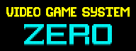
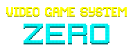
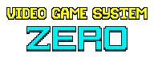
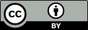

# Design Assets

このディレクトリ以下の画像は VGS-Zero 対応ゲームのパッケージやランディングページのデザイン素材です。

## Assets

| name | image | memo |
| [logo1_basic_192x72.png](./logo1_basic_192x72.png) |  | ロゴ（基本形） |
| [logo1_transparent_192x72.png](./logo1_transparent_192x72.png) |  | ロゴ（透明） |
| [logo1_edge_192x72.png](./logo1_edge_192x72.png) |  | ロゴ（縁取り） |
| [logo2_basic_192x72.png](./logo2_basic_192x72.png) |  | ロゴ+対応機種（基本形） |
| [logo2_transparent_192x72.png](./logo2_transparent_192x72.png) |  | ロゴ+対応機種（透明） |
| [logo2_edge_192x72.png](./logo2_edge_192x72.png) |  | ロゴ+対応機種（縁取り） |

## License

CC 4.0 by

