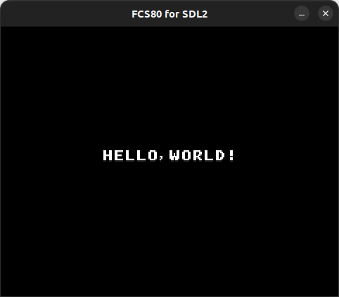

# Hello, World



## How to build

### Pre-request

- GNU make and GNU Compiler Collection
  - macOS: install XCODE
  - Linux: `sudo apt install build-essential`
- SDCC
  - macOS: `brew install sdcc`
  - Linux: `sudo apt-get install sdcc`

### Build

```zsh
git clone https://github.com/suzukiplan/vgszero
cd vgszero/example/hello
make
```
