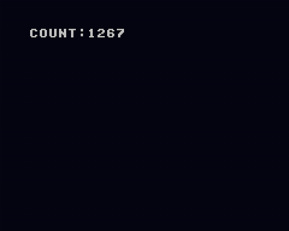

# Global Variables

グローバル変数の利用例です



## How to build

```zsh
sudo apt install build-essential
git clone https://github.com/suzukiplan/vgszero
cd vgszero/example/02_global
make
```

## ROM structure

```
8KB x 2 banks = 16KB ROM
```

- Bank 0: program
- Bank 1: font.chr
