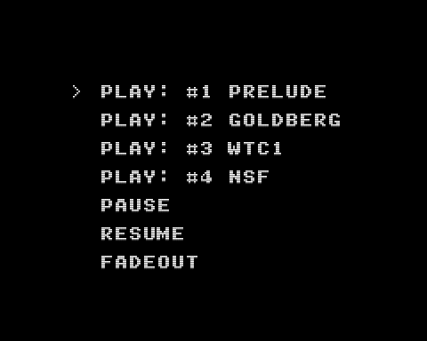

# Sound 

- BGM を再生・ポーズ・再開・フェードアウト
- 効果音を再生
- ジョイパッドで操作します



## How to build

### Pre-request

- GNU make and GNU Compiler Collection
  - macOS: install XCODE
  - Linux: `sudo apt install build-essential`
- SDCC version 4.1.0
  - macOS(x64): [https://sourceforge.net/projects/sdcc/files/sdcc-macos-amd64/4.1.0/](https://sourceforge.net/projects/sdcc/files/sdcc-macos-amd64/4.1.0/)
  - Linux(x64): [https://sourceforge.net/projects/sdcc/files/sdcc-linux-amd64/4.1.0/](https://sourceforge.net/projects/sdcc/files/sdcc-linux-amd64/4.1.0/)

### Build

```zsh
git clone https://github.com/suzukiplan/vgszero
cd vgszero/example/03_sound
make
```

## ROM structure

```
8KB x 3 banks = 24KB ROM
```

- Bank 0: program
- Bank 1: program
- Bank 2: font.chr

## BGM structure

- BGM 0: [./song1.mml](./song1.mml)
- BGM 1: [./song2.mml](./song2.mml)
- BGM 2: [./song3.mml](./song3.mml)
- BGM 4: [./song4.nsf](./song4.nsf)

## Sound Effect structure

- SE 0: [./se_move.wav](./se_move.wav)
- SE 1: [./se_enter.wav](./se_enter.wav)

## Note

効果音の作成には [Jfxr](https://github.com/ttencate/jfxr) を使用しています。
