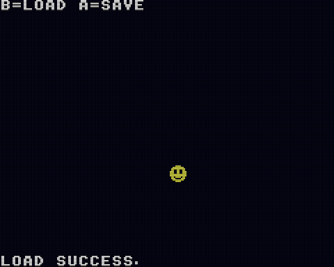

# Save

セーブ機能の使用例です。



- カーソルでキャラクタを上下左右に移動できます
- A ボタンを押すと現在のキャラクタの座標が保存されます
- B ボタンを押すとセーブされた座標をロードします
- ゲーム起動時に前回のセーブデータが自動的に読み込まれます
- セーブデータ（save.dat）が存在しない状態でゲームを起動すると座標が画面中央に初期化されます
- セーブデータ（save.dat）が存在しない状態でロードをすると失敗してデフォルトの動作（対象データが0クリア）されることで座標が0,0（左上の画面外）になります

## How to build

```zsh
sudo apt install build-essential libsdl2-dev libasound2 libasound2-dev
git clone https://github.com/suzukiplan/vgszero
cd vgszero/example/06_save-asm
make
```

## ROM structure

```
8KB x 2 banks = 16KB ROM
```

- Bank 0: program
- Bank 1: font.chr
