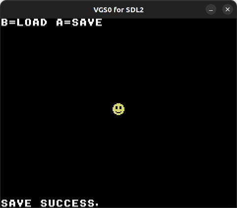

# Save

セーブ機能の使用例です。



- カーソルでキャラクタを上下左右に移動できます
- A ボタンを押すと現在のキャラクタの座標が保存されます
- B ボタンを押すとセーブされた座標をロードします
- ゲーム起動時に前回のセーブデータが自動的に読み込まれます
- セーブデータ（save.dat）が存在しない状態でゲームを起動すると座標が画面中央に初期化されます
- セーブデータ（save.dat）が存在しない状態でロードをすると失敗してデフォルトの動作（対象データが0クリア）されることで座標が0,0（左上の画面外）になります

## How to build

### Pre-request

- GNU make and GNU Compiler Collection
  - macOS: install XCODE
  - Linux: `sudo apt install build-essential`
- SDCC
  - macOS: `brew install sdcc`
  - Linux: `sudo apt-get install sdcc`

### Build

```zsh
git clone https://github.com/suzukiplan/vgszero
cd vgszero/example/06_save
make
```

## ROM structure

```
8KB x 3 banks = 24KB ROM
```

- Bank 0: program
- Bank 1: program
- Bank 2: font.chr

## Program Code

```c
#include "../../lib/sdcc/vgs0lib.h"

#define SPRITE_NUM 256

// グローバル変数
typedef struct {
    uint8_t x;
    uint8_t y;
} GlobalVariables;
#define GV ((GlobalVariables*)0xC000)

void main(void)
{
    // パレットを初期化
    vgs0_palette_set_rgb555(0, 0, 0b0000000000000000);
    vgs0_palette_set_rgb555(0, 1, 0b0001110011100111);
    vgs0_palette_set_rgb555(0, 2, 0b0110001100011000);
    vgs0_palette_set_rgb555(0, 3, 0b0111111111111111);
    vgs0_palette_set_rgb555(0, 4, 0b0000001110000000);
    vgs0_palette_set_rgb555(0, 5, 0b0000000000011100);

    // Bank 2 を Character Pattern Table (0xA000) に転送 (DMA)
    vgs0_dma(2);

    // FGの左上に使い方を表示
    vgs0_fg_putstr(1, 1, 0x80, "B=LOAD A=SAVE");

    // 座標をsave.datからロード
    if (0 != vgs0_load((uint16_t)GV, sizeof(GlobalVariables))) {
        // 読み込めなかったので初期座標を中央に設定
        GV->x = (256 - 8) / 2;
        GV->y = (200 - 8) / 2;
    }

    // スプライト表示
    vgs0_oam_set(0, GV->x, GV->y, 0x80, '@');

    // メインループ
    const char* msg = 0;
    uint8_t msgcnt = 0;
    while (1) {
        // V-BLANK を待機
        vgs0_wait_vsync();
        uint8_t pad = vgs0_joypad_get();

        // メッセージ表示
        if (0 != msgcnt) {
            if (60 == msgcnt) {
                vgs0_fg_putstr(1, 24, 0x80, msg);
            }
            msgcnt--;
            if (0 == msgcnt) {
                for (uint8_t i = 0; i < 32; i++) {
                    VGS0_ADDR_FG->attr[24][i] = 0;
                }
            }
        }

        // スプライトの移動
        if (pad & VGS0_JOYPAD_LE) {
            GV->x -= 2;
        } else if (pad & VGS0_JOYPAD_RI) {
            GV->x += 2;
        }
        if (pad & VGS0_JOYPAD_UP) {
            GV->y -= 2;
        } else if (pad & VGS0_JOYPAD_DW) {
            GV->y += 2;
        }

        if (0 == msgcnt) {
            if (pad & VGS0_JOYPAD_T1) {
                if (0 == vgs0_save((uint16_t)GV, sizeof(GlobalVariables))) {
                    msg = "SAVE SUCCESS.";
                    msgcnt = 60;
                } else {
                    msg = "SAVE FAILED!";
                    msgcnt = 60;
                }
            }
            if (pad & VGS0_JOYPAD_T2) {
                if (0 == vgs0_load((uint16_t)GV, sizeof(GlobalVariables))) {
                    msg = "LOAD SUCCESS.";
                    msgcnt = 60;
                } else {
                    msg = "LOAD FAILED!";
                    msgcnt = 60;
                }
            }
        }

        // スプライトの座標更新
        VGS0_ADDR_OAM[0].x = GV->x;
        VGS0_ADDR_OAM[0].y = GV->y;
    }
}
```
