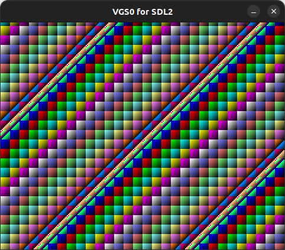

# Palette

16種類のパレットをすべて使う例です。



## How to build

### Pre-request

- GNU make and GNU Compiler Collection
  - macOS: install XCODE
  - Linux: `sudo apt install build-essential`
- SDCC version 4.1.0
  - macOS(x64): [https://sourceforge.net/projects/sdcc/files/sdcc-macos-amd64/4.1.0/](https://sourceforge.net/projects/sdcc/files/sdcc-macos-amd64/4.1.0/)
  - Linux(x64): [https://sourceforge.net/projects/sdcc/files/sdcc-linux-amd64/4.1.0/](https://sourceforge.net/projects/sdcc/files/sdcc-linux-amd64/4.1.0/)

### Build

```zsh
git clone https://github.com/suzukiplan/vgszero
cd vgszero/example/07_palette
make
```

## ROM structure

```
8KB x 3 banks = 24KB ROM
```

- Bank 0: program
- Bank 1: program
- Bank 2: image.chr

## Program Code

```c
#include "../../lib/sdcc/vgs0lib.h"
#include "palette.h"

void main(void)
{
    // パレットを初期化
    init_palette();

    // Bank 2 を Character Pattern Table (0xA000) に転送 (DMA)
    vgs0_dma(2);

    // BG Name Table を設定
    uint8_t attr = 0;
    for (int y = 0; y < 32; y++) {
        for (int x = 0; x < 32; x++) {
            VGS0_ADDR_BG->ptn[y][x] = 0x00;
            VGS0_ADDR_BG->attr[y][x] = 0x80 | ((attr + y) & 0x0F);
            attr++;
        }
    }

    // 縦スクロール
    while (1) {
        vgs0_wait_vsync();
        *VGS0_ADDR_BG_SCROLL_Y += 1;
    }
}
```
