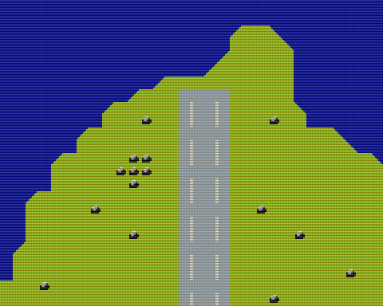

# Map Scroll (vgsasm version)

View and scroll through map data created with the [Tiled Map Editor](https://www.mapeditor.org).



## How to build

```zsh
sudo apt install build-essential libsdl2-dev libasound2 libasound2-dev
git clone https://github.com/suzukiplan/vgszero
cd vgszero/example/08_map-scroll-asm
make
```

## ROM structure

```
8KB x 3 banks = 24KB ROM
```

- Bank 0: program
- Bank 1: image.chr
- Bank 2: mapdata.bin
