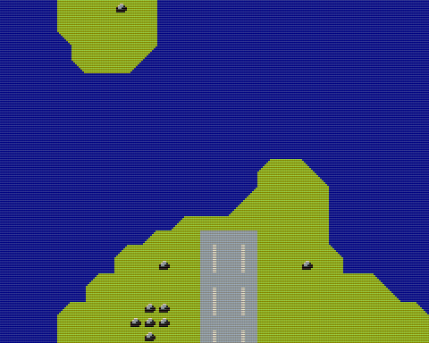

# Map Scroll (SDCC version)

View and scroll through map data created with the [Tiled Map Editor](https://www.mapeditor.org).



## How to build

### Pre-request

- GNU make
- gcc
- sdcc
  - macOS: `brew install sdcc`
  - Linux: `sudo apt-get install sdcc`

### Map data

- [mapdata.tmx](mapdata.tmx) & [image.tsx](image.tsx) are data that created with the [Tiled Map Editor](https://www.mapeditor.org).

### Build

```zsh
cd fcs80/example/map_scroll-sdcc
make
```
