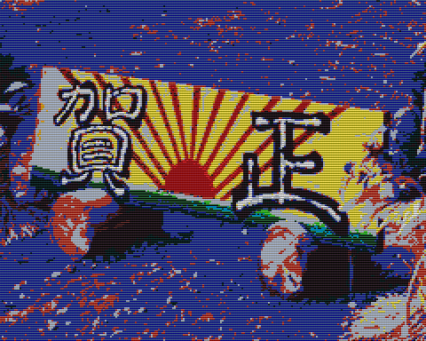

# Full screen character display 

Direct Pattern Mapping を用いて全画面に異なるパターン（30x24=720）を表示します。



> [1024 パターンモード](../14_1024ptn/) を用いればよりスマートにこの目的を実現できます。

## How to build

```zsh
sudo apt install build-essential libsdl2-dev libasound2 libasound2-dev
git clone https://github.com/suzukiplan/vgszero
cd vgszero/example/10_chr720-asm
make
```

## ROM structure

```
8KB x 4 banks = 32KB ROM
```

- Bank 0: program
- Bank 1: bg.chr
- Bank 2: fg.chr
- Bank 3: sprite.chr

