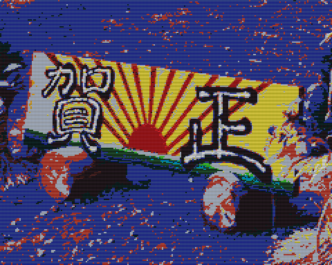

# Full screen character display 

Direct Pattern Mapping を用いて全画面に異なるパターン（30x24=720）を表示します。



> [1024 パターンモード](../14_1024ptn/) を用いればよりスマートにこの目的を実現できます。

## How to build

### Pre-request

- GNU make and GNU Compiler Collection
  - macOS: install XCODE
  - Linux: `sudo apt install build-essential`
- SDCC version 4.1.0
  - macOS(x64): [https://sourceforge.net/projects/sdcc/files/sdcc-macos-amd64/4.1.0/](https://sourceforge.net/projects/sdcc/files/sdcc-macos-amd64/4.1.0/)
  - Linux(x64): [https://sourceforge.net/projects/sdcc/files/sdcc-linux-amd64/4.1.0/](https://sourceforge.net/projects/sdcc/files/sdcc-linux-amd64/4.1.0/)

### Build

```zsh
git clone https://github.com/suzukiplan/vgszero
cd vgszero/example/10_chr720
make
```

## ROM structure

```
8KB x 5 banks = 40KB ROM
```

- Bank 0: program
- Bank 1: program
- Bank 2: bg.chr
- Bank 3: fg.chr
- Bank 4: sprite.chr
