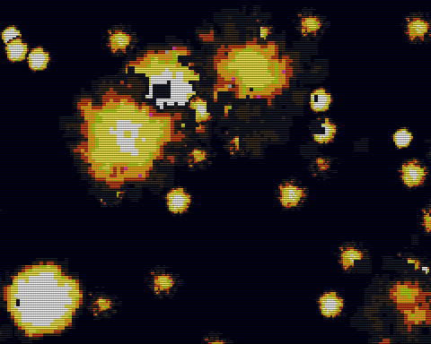

# BigSprite

3x3 キャラクタ (24x24 ピクセル) と 12x12 キャラクタ (96x96 ピクセル) のスプライト描画



## How to build

```zsh
sudo apt install build-essential libsdl2-dev libasound2 libasound2-dev
git clone https://github.com/suzukiplan/vgszero
cd vgszero/example/11_bigsprite-asm
make
```

## ROM structure

```
8KB x 17 banks = 136KB ROM
```

- Bank 0: program
- Bank 1: image00.chr
- Bank 2: image01.chr
- Bank 3: image02.chr
- Bank 4: image03.chr
- Bank 5: image04.chr
- Bank 6: image05.chr
- Bank 7: image06.chr
- Bank 8: image07.chr
- Bank 9: image08.chr
- Bank 10: image09.chr
- Bank 11: image10.chr
- Bank 12: image11.chr
- Bank 13: image12.chr
- Bank 14: image13.chr
- Bank 15: image14.chr
- Bank 16: image15.chr
