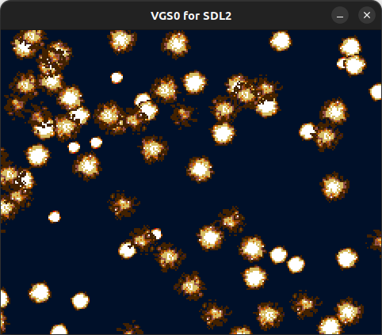

# BigSprite

3x3 キャラクタ (24x24 ピクセル) と 12x12 キャラクタ (96x96 ピクセル) のスプライト描画



## How to build

### Pre-request

- GNU make and GNU Compiler Collection
  - macOS: install XCODE
  - Linux: `sudo apt install build-essential`
- SDCC version 4.1.0
  - macOS(x64): [https://sourceforge.net/projects/sdcc/files/sdcc-macos-amd64/4.1.0/](https://sourceforge.net/projects/sdcc/files/sdcc-macos-amd64/4.1.0/)
  - Linux(x64): [https://sourceforge.net/projects/sdcc/files/sdcc-linux-amd64/4.1.0/](https://sourceforge.net/projects/sdcc/files/sdcc-linux-amd64/4.1.0/)

### Build

```zsh
git clone https://github.com/suzukiplan/vgszero
cd vgszero/example/11_bigsprite
make
```

## ROM structure

```
8KB x 18 banks = 144KB ROM
```

- Bank 0: program
- Bank 1: program
- Bank 2: image00.chr
- Bank 3: image01.chr
- Bank 4: image02.chr
- Bank 5: image03.chr
- Bank 6: image04.chr
- Bank 7: image05.chr
- Bank 8: image06.chr
- Bank 9: image07.chr
- Bank 10: image08.chr
- Bank 11: image09.chr
- Bank 12: image10.chr
- Bank 13: image11.chr
- Bank 14: image12.chr
- Bank 15: image13.chr
- Bank 16: image14.chr
- Bank 17: image15.chr
