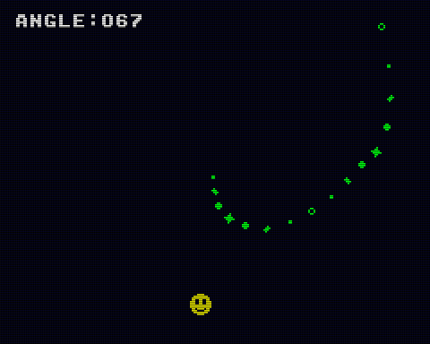

# Angle

シューティングゲームなどでよく使われる自機狙い弾（プレイヤーの方向に向かって飛んでくる敵弾）を `io.angle` を用いて高精度（256-angle）＆高速化したサンプルです。



- カーソルでキャラクタを上下左右に移動できます
- スタートボタンを押しながらカーソルで発射元を上下左右に移動できます
- 画面中央から自機狙いの弾が発射され続けます

## How to build

```zsh
sudo apt install build-essential libsdl2-dev libasound2 libasound2-dev
git clone https://github.com/suzukiplan/vgszero
cd vgszero/example/12_angle-asm
make
```

## ROM structure

```
8KB x 2 banks = 16KB ROM
```

- Bank 0: program
- Bank 1: font.chr
