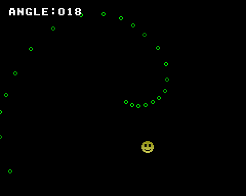

# Angle

シューティングゲームなどでよく使われる自機狙い弾（プレイヤーの方向に向かって飛んでくる敵弾）を HAG を用いて高精度（256-angle）＆高速化したサンプルです。



- カーソルでキャラクタを上下左右に移動できます
- 画面中央から自機狙いの弾が発射され続けます
- 画面左上に `vgs0_angle` の戻り値 (angle) をデバッグ表示します
- angle は真下方向が 0 で時計回りになっています

|(sx,sy) に対する (dx,dy) の位置|agnle|
|:-:|:-:|
| 下 | 0 (256) |
| 右下 | 32 |
| 右 | 64 |
| 右上 | 96 |
| 上 | 128 |
| 左上 | 160 |
| 左 | 192 |
| 左下 | 224 |

## How to build

### Pre-request

- GNU make and GNU Compiler Collection
  - macOS: install XCODE
  - Linux: `sudo apt install build-essential`
- SDCC version 4.1.0
  - macOS(x64): [https://sourceforge.net/projects/sdcc/files/sdcc-macos-amd64/4.1.0/](https://sourceforge.net/projects/sdcc/files/sdcc-macos-amd64/4.1.0/)
  - Linux(x64): [https://sourceforge.net/projects/sdcc/files/sdcc-linux-amd64/4.1.0/](https://sourceforge.net/projects/sdcc/files/sdcc-linux-amd64/4.1.0/)

### Build

```zsh
git clone https://github.com/suzukiplan/vgszero
cd vgszero/example/12_angle
make
```

## ROM structure

```
8KB x 3 banks = 24KB ROM
```

- Bank 0: program
- Bank 1: program
- Bank 2: font.chr
