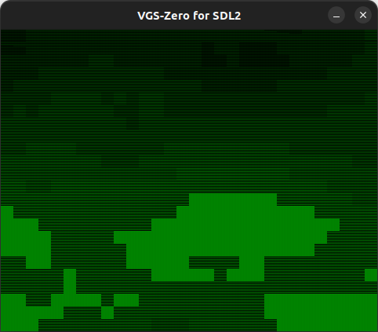

# Perlin Noise

パーリンノイズという地形のようなデータを自動生成に便利な HAGe の利用例です

> パーリンノイズに関する詳細は以下の記事でご確認ください。
> 
> - [実装レベルで簡単に理解できる Qiita の記事](https://qiita.com/gis/items/ba7d715901a0e572b0e9)
> - [原理を理解できる詳しい記事](https://postd.cc/understanding-perlin-noise/)



- カーソルで上下左右にスクロールできます
- スタートボタンを押せば乱数シードを更新して再生成します

## How to build

### Pre-request

- GNU make and GNU Compiler Collection
  - macOS: install XCODE
  - Linux: `sudo apt install build-essential`
- SDCC version 4.1.0
  - macOS(x64): [https://sourceforge.net/projects/sdcc/files/sdcc-macos-amd64/4.1.0/](https://sourceforge.net/projects/sdcc/files/sdcc-macos-amd64/4.1.0/)
  - Linux(x64): [https://sourceforge.net/projects/sdcc/files/sdcc-linux-amd64/4.1.0/](https://sourceforge.net/projects/sdcc/files/sdcc-linux-amd64/4.1.0/)

### Build

```zsh
git clone https://github.com/suzukiplan/vgszero
cd vgszero/example/13_perlin
make
```

## ROM structure

```
8KB x 3 banks = 24KB ROM
```

- Bank 0: program
- Bank 1: program
- Bank 2: image.chr
