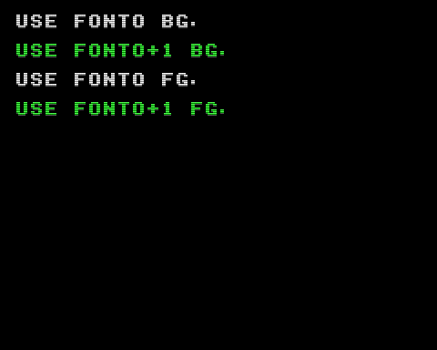

# Attribute PTN Example

アトリビュートの `PTN` (bit-4) の指定により DPM + 1 のバンクのパターンを表示するプログラムの実装例です。



## How to build

```zsh
sudo apt install build-essential libsdl2-dev libasound2 libasound2-dev
git clone https://github.com/suzukiplan/vgszero
cd vgszero/example/16_ptn-plus1-asm
make
```

## ROM structure

```
8KB x 3 banks = 24KB ROM
```

- Bank 0: program
- Bank 1: font0.chr
- Bank 2: font1.chr
