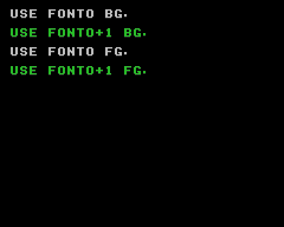

# Attribute PTN Example

アトリビュートの `PTN` (bit-4) の指定により DPM + 1 のバンクのパターンを表示するプログラムの実装例です。



## How to build

### Pre-request

- GNU make and GNU Compiler Collection
  - macOS: install XCODE
  - Linux: `sudo apt install build-essential`
- SDCC version 4.1.0
  - macOS(x64): [https://sourceforge.net/projects/sdcc/files/sdcc-macos-amd64/4.1.0/](https://sourceforge.net/projects/sdcc/files/sdcc-macos-amd64/4.1.0/)
  - Linux(x64): [https://sourceforge.net/projects/sdcc/files/sdcc-linux-amd64/4.1.0/](https://sourceforge.net/projects/sdcc/files/sdcc-linux-amd64/4.1.0/)

### Build

```zsh
git clone https://github.com/suzukiplan/vgszero
cd vgszero/example/16_ptn-plus1
make
```

## ROM structure

```
8KB x 4 banks = 32KB ROM
```

- Bank 0: program
- Bank 1: program
- Bank 2: font0.chr
- Bank 3: font1.chr
