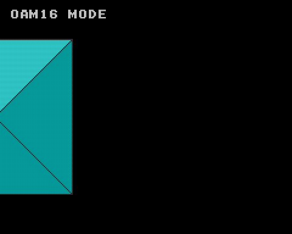

# Clip Sprite with OAM16

OAM16 を用いてスプライトをクリップして表示する実装例です。

|OAM16|OAM|
|:-:|:-:|
|||

- スプライト (128x128) は上下左右に移動できます
- OAM と OAM16 は START ボタンで切り替えることができます

## How to build

```zsh
sudo apt install build-essential libsdl2-dev libasound2 libasound2-dev
git clone https://github.com/suzukiplan/vgszero
cd vgszero/example/17_clip-asm
make
```

## ROM structure

```
8KB x 3 banks = 24KB ROM
```

- Bank 0: program
- Bank 1: font.chr
- Bank 2: sprite.chr
