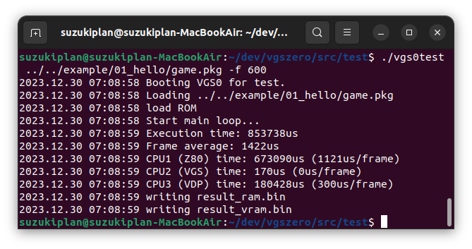

# VGS-Zero for Test

VGS-Zero のテストツールです。




## How to Use

```
vgs0test -f 実行フレーム数
         -r 結果ファイルプレフィクス
         game.pkg
```

## Results

### CPU time

RaspberryPi Zero 2W のサブCPU（CPU1〜3）で実行される処理時間を算出しています。

```
2023.12.30 07:08:59 CPU1 (Z80) time: 673090us (1121us/frame)
2023.12.30 07:08:59 CPU2 (VGS) time: 170us (0us/frame)
2023.12.30 07:08:59 CPU3 (VDP) time: 180428us (300us/frame)
```

### result_ram.bin

RAM のバイナリダンプです。

CI でテストした時に結果が従来の結果と変化しないことをチェックすることでデグレード検査ができます。

### result_vram.bin

VRAM のバイナリダンプです。

CI でテストした時に結果が従来の結果と変化しないことをチェックすることでデグレード検査ができます。
