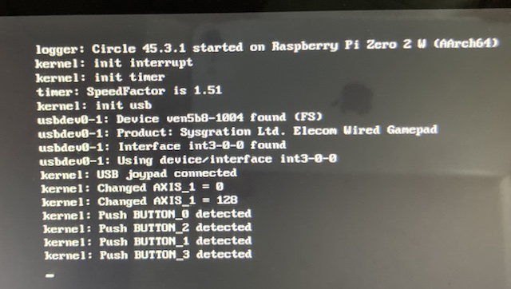

# Joypad Preview Tool

## Description

RaspberryPi Zero 2W 上でジョイパッドの入力ボタンをチェックするツールです。



## How to Use

- [./image/kernel8.img](./image/kernel8.img)、[../../image/bootcode.bin](../../image/bootcode.bin)、[../../image/start.elf](../../image/start.elf) を SD カードのルートディレクトリに配置すれば起動できます。
- USB ジョイパッドの入力状態が変化すると変化内容を画面上に出力します

### Button Detection

```
kernel: Push BUTTON_n detected
```

### AXIS Detection

```
kernel: Changed AXIS_n = value
```

### [config.sys](../../README.md#configsys) への反映

VGS-Zero のカーソル、A/B、Start/Select に割り当てたいボタンを [config.sys](../../README.md#configsys) に設定して下さい。
